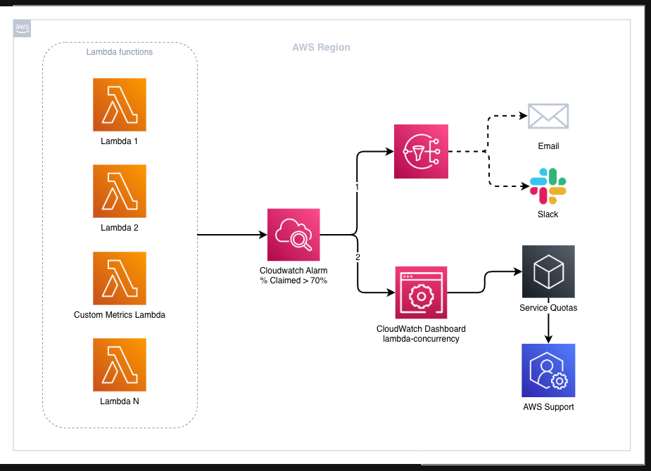
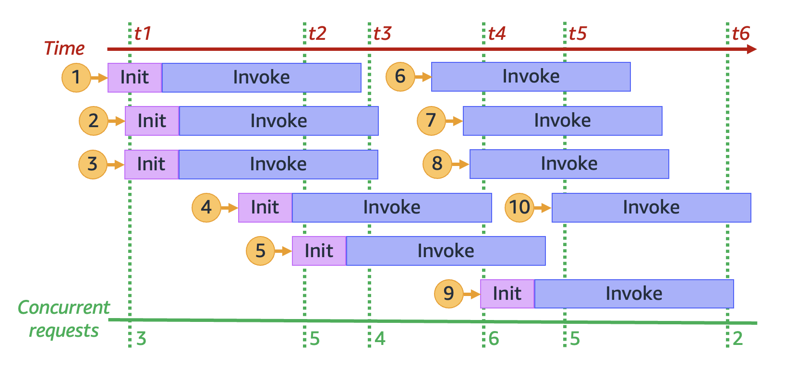
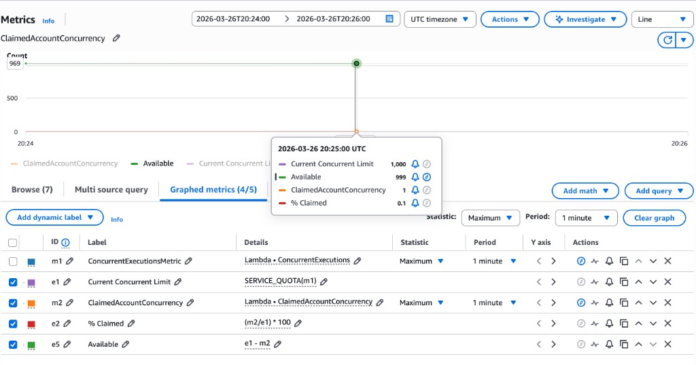

# AWS Lambda: Monitoring Concurrency with ClaimedAccountConcurrency



In Lambda, concurrency is how many invocations your functions can run at the same time in a Region. As traffic grows, Lambda adds execution environments to keep up, until you reach your regional concurrency limit. Past that point, new requests are throttled. Understanding these limits, and knowing how to monitor them, is what keeps you from being surprised in production.

> **New to Lambda?** AWS Lambda is a compute service that runs your code in response to events (API requests, queue messages, file uploads, and so on) without requiring you to manage servers. It scales automatically as traffic increases.

This article explains what the regional limit really means, how to monitor it with CloudWatch, and how to find how much capacity you actually have left in a Region.

This repository also includes the [Lambda Concurrency Dashboard](./dashboard/), which is ready for deployment. This solution will enable you to proactively monitor your region, understand the top consumers, and make quick decisions between **requesting a limit increase** and **managing capacity via Reserved (RC) or Provisioned Concurrency (PC)**.


The dashboard also gives you **actionable buttons** to **modify concurrency settings** for individual functions.


For legitimate scaling traffic, you can also check the [Automation for Limit Increase](./auto-increase/), which provides a one shot automated increase while still requiring human verification.

For now, let's explore the concepts behind the regional concurrency limit.

**What we will cover:**

1. How Lambda concurrency works
2. Understanding the `ClaimedAccountConcurrency` metric
3. Calculating utilization with worked scenarios
4. Setting up a CloudWatch alarm in the console
5. Solutions to deploy a monitoring dashboard and auto-increase solution with CDK

> **Note:** This guide uses the **AWS Console**. While Infrastructure as Code (CloudFormation, CDK, Terraform) is more efficient for production environments, using the console first can be beneficial for learning purposes. The idea is to get familiar with the concepts first. After that, translating to IaC is straightforward. If you have familiar with these concepts, ready-to-deploy CDK examples are available at the end of this article.

---

## How Lambda concurrency works

For each concurrent request, Lambda provisions a separate instance of your execution environment. Execution environments are secure, isolated environments that run on hardware-virtualized virtual machines (MicroVMs). They manage the resources required to run your function and provide lifecycle support for the function's runtime and any external extensions associated with your function.

As your functions receive more requests, Lambda automatically handles scaling the number of execution environments until you reach your account's concurrency limit.

There are two scaling quotas to consider: **account concurrency** and **burst concurrency**.

**Account concurrency:**
- is the hard ceiling on simultaneous executions in a Region. Every function in the account draws from the same pool. The default quota is 1,000 concurrent executions per Region, and you can raise it through Service Quotas.

**Burst concurrency:**
- the maximum rate at which functions in your account can scale in response to increased requests. That is, how quickly Lambda can create new execution environments.

When your regional concurrency limit is hit, throttling can have a cascading effect. If your application uses Lambda as middleware between, for instance, API Gateway, SQS, Kinesis, or DynamoDB, throttles will affect how those services behave. It is important to monitor proactively.

There are also two concurrency controls available at the function level: Reserved concurrency (RC) and Provisioned concurrency (PC). We cover how each one consumes the pool below.

### What is my current limit?

By default, every account gets **1,000 concurrent executions per Region**. However, this is a soft limit you can increase via [Service Quotas](https://docs.aws.amazon.com/servicequotas/latest/userguide/request-quota-increase.html).

**Notes:**

> New AWS accounts have reduced concurrency and memory quotas. AWS raises these quotas automatically based on your usage.

> Lambda always [keeps 100 units](https://docs.aws.amazon.com/lambda/latest/dg/lambda-concurrency.html#:~:text=At%20the%20function,the%20function%20level.) available for functions without RC.

For more information, please refer to [Understanding and visualizing concurrency](https://docs.aws.amazon.com/lambda/latest/dg/lambda-concurrency.html#understanding-concurrency).

### Regional concurrency limit vs scaling rate

The concurrency scaling rate differs from the account-level concurrency limit, which is the total amount of concurrency available to your functions.

To protect against over-scaling in response to sudden bursts of traffic, there is a limit on how quickly new execution environments will be created.

In each AWS Region, and for each function, your concurrency scaling rate is 1,000 execution environment instances every 10 seconds (or 10,000 requests per second every 10 seconds). In other words, every 10 seconds, Lambda can allocate at most 1,000 additional execution environment instances, or accommodate 10,000 additional requests per second, to each of your functions.

You can hit this scaling ceiling even when total account concurrency is not fully utilized. Sudden spikes may be throttled while capacity still appears available on the dashboard.

For more information, see [Lambda scaling behavior](https://docs.aws.amazon.com/lambda/latest/dg/scaling-behavior.html#scaling-rate).

### Visual walkthrough



From the green lines, at time `t1`, there are three active environments serving three concurrent requests.

At `t2` there are **5 active environments**, so the concurrency at that moment is **5**. Requests 1 through 5 each had their "INIT" phase. Hence, they were all cold starts, and each consumed 1 concurrent execution.

Then, between `t3` and `t4`, requests 6, 7, 8 did not have "INIT". This means they reused environments that started earlier, so these requests were `warm starts`.

Around `t4` request 9 required a new environment, hence, it was a cold start. After this, request 10 came in (warm start), and reused a pre-existing environment.

For these requests, 6 required new execution environments (cold starts) and 4 reused existing warm environments. Important to note that when observing the green line, the number of concurrent requests varied over time.

### When increasing the limit won't help

For critical functions, setting a [Reserved Concurrency](https://docs.aws.amazon.com/lambda/latest/dg/configuration-concurrency.html) (RC) is recommended. Reserved concurrency guarantees dedicated capacity that no on-demand functions can consume.

When you hit the regional limit, it is recommended to investigate before requesting more capacity. Examples where increasing the limit will not help:

- **Reserved Concurrency over limit increases.** If you have multiple functions in the same region and you predict on-demand traffic growth across multiple functions, use RC to protect the critical ones. It will ensure no other function in your region can use the reserved portion you allocated for them. Note: RC also caps the function, always plan RC according to expected traffic.

- **Runaway error loops.** An erroring function. Raising the concurrency limit just gives it more room to fail for functions that are not using reserved concurrency. Always check whether the consumer is healthy before requesting more capacity. If it is broken, cap it with reserved concurrency instead.

- **Async invocations.** Synchronous invocations get throttled visibly. However, asynchronous invocations (CloudFormation custom resources, S3 triggers, EventBridge) are queued for up to 6 hours. For these, check `AsyncEventAge` and review the `MaximumEventAgeInSeconds` for critical async functions.

In every case, throttling can benefit you and act as a circuit breaker. Only increase the limit when the consumer is healthy and the traffic is legitimate.

---

## Understanding ClaimedAccountConcurrency

For monitoring concurrency, Lambda exposes different metrics in CloudWatch:

| Metric | What it measures |
| :------------------------------- | :-------------------------------------------------------------- |
| `ConcurrentExecutions` | The number of active concurrent invocations at a given point in time |
| `UnreservedConcurrentExecutions` | Invocations using the remaining pool (does not consider reserved or provisioned concurrency) |
| `ClaimedAccountConcurrency` | Total concurrency **unavailable** for new on-demand invocations |

"_Ahhh, okay, if I want to monitor the regional limit, I must track the ConcurrentExecutions metric!_"

Well... partially correct. Monitoring these can help you plan how your current limit is distributed across your Region, and how a specific function consumes the shared pool. However, to understand the actual utilization in your Region, we must focus on ClaimedAccountConcurrency instead.

### What ClaimedAccountConcurrency captures

```
ClaimedAccountConcurrency = UnreservedConcurrentExecutions + Allocated Concurrency
```

We understand `UnreservedConcurrentExecutions`, but what about **Allocated concurrency**?

Allocated Concurrency represents the sum of both:
1. **Reserved concurrency (RC)**: ensures the function gets a guaranteed slice of the available pool for your region. The function also cannot exceed that amount or use unreserved capacity. No other function can use it, even if the function is idle. This can be configured at the function level. It consumes your pool even when not in use.
2. **Provisioned concurrency (PC)**: This allows you to have pre-initialized environments for individual functions. It counts against the pool even when the function is not processing requests.

**Notes:**

> Lambda always [keeps 100 units](https://docs.aws.amazon.com/lambda/latest/dg/lambda-concurrency.html#:~:text=At%20the%20function,the%20function%20level.) available for functions without RC.

> If a function has both RC and PC configured, Lambda counts only the RC (since RC should always be ≥ PC). PC is only counted separately for functions that don't have RC.

If you want to run a quick test in `us-east-1`, set reserved concurrency to a high number on a function (right below your limit), invoke another function, then check the metrics below. You should see a spike for ClaimedCOncurrency (allow a few seconds to propagate):

```
https://us-east-1.console.aws.amazon.com/cloudwatch/home?region=us-east-1#metricsV2?graph=~(metrics~(~(~(expression~'SERVICE_QUOTA*28m1*29~label~'Current*20Concurrent*20Limit~id~'e1~period~60~yAxis~'left~color~'*239467bd))~(~'AWS*2fLambda~'ConcurrentExecutions~(id~'m1~yAxis~'left~label~'ConcurrentExecutionsMetric~visible~false))~(~'.~'UnreservedConcurrentExecutions~(id~'m3))~(~'.~'ClaimedAccountConcurrency~(id~'m2~yAxis~'left~color~'*23ff7f0e))~(~(expression~'*28m2*2fe1*29*20*2a*20100~label~'*25*20Claimed~id~'e2~period~60~yAxis~'left))~(~(expression~'e1*20-*20m2~label~'Available~id~'e5~period~60~yAxis~'left~color~'*232ca02c))~(~'AWS*2fLambda~'Invocations~(id~'m4~stat~'Sum)))~sparkline~false~view~'timeSeries~stacked~false~region~'us-east-1~period~60~stat~'Maximum~liveData~false~labels~(visible~true)~legend~(position~'bottom)~start~'-PT5M~end~'P0D)&query=~'*7bAWS*2fLambda*7d
```

---

## Calculating the regional limit

### Scenario 1: account limit 10

Let's consider this example:

| Configuration | Value |
| :------------------------------- | :-------------------------------------------------------------- |
| Account concurrency limit for your region | 10 |
| Reserved concurrency (function A) | 3 |
| Reserved concurrency (function B) | 3 |
| Provisioned concurrency (function C, PC only, no RC) | 2 |
| Active executions (unreserved concurrent executions for function D) | 1 |

For the example above, `ClaimedAccountConcurrency` is equal to 9, and we only have 1 as our current capacity for this region.


### Scenario 2: account limit 1,000

| Configuration | Value |
| :------------------------------------------------ | :----- |
| Account concurrency limit | 1,000 |
| Reserved concurrency (function A) | 400 |
| Reserved concurrency (function B) | 400 |
| Provisioned concurrency (function C, PC only, no RC) | 100 |
| Active executions (unreserved concurrent executions across functions D, E, F) | 60 |

In this example, since 60 active executions are being consumed across functions that do not have reserved or provisioned concurrency, the utilization should be 960. See calculation below:

```
ClaimedAccountConcurrency = UnreservedConcurrentExecutions + Allocated Concurrency
ClaimedAccountConcurrency = 60 + allocated concurrency (400 + 400 + 100 = 900)
```

As per the above, only 60 on-demand invocations are running, but 900 additional units are allocated (claimed by RC/PC), giving a total `ClaimedAccountConcurrency` of **960**. Actual concurrency available for new on-demand invocations is **40**.


### Scenario 3: unreserved concurrency spike

If any executions are running on _unreserved_ functions and `ClaimedAccountConcurrency` goes beyond the regional limit, you should expect throttling.

This example builds on Scenario 2. Same allocation, then a sudden spike on unreserved functions:

| Configuration | Value |
| :------------------------------------------------ | :----- |
| Account concurrency limit | 1,000 |
| Reserved concurrency (function A) | 400 |
| Reserved concurrency (function B) | 400 |
| Provisioned concurrency (function C, PC only, no RC) | 100 |
| Active executions (unreserved concurrent executions across functions D, E, F) | 60 |
| New spike + (unreserved concurrent executions across functions G, H, I) | 150 |

In this example, you have the Reserved concurrency for functions A, B, and C, and between functions D, E, and F you consume more than 60 concurrent environments (unreserved concurrency). Your total utilization is 960, hence available capacity is 40.

However, in this case you have a new spike and other functions are being invoked concurrently. Let's call them functions G, H, and I. Between them, **150 new concurrent executions** happen (in addition to the 60 we had before). At that point in time, only **40** concurrent executions were available, so only **40** can run immediately. For the remaining **110** concurrent executions you should expect throttling, as the number of concurrent requests will now be above the regional limit.

Calculation:
-  available concurrency = your regional limit − ClaimedAccountConcurrency
-  1,000 − 960 = 40

Now let's simulate an additional 150 unreserved concurrency:
-  150 (new spike of unreserved concurrency) − 40 (available concurrency)
Result: 110 Throttles.


You can see more examples from [Reserved concurrency diagram](https://docs.aws.amazon.com/lambda/latest/dg/lambda-concurrency.html#understanding-concurrency:~:text=To%20better%20understand%20reserved%20concurrency%2C%20consider%20the%20following%20diagram%3A) and [Provisioned Concurrency + Reserved concurrency diagram](https://docs.aws.amazon.com/lambda/latest/dg/lambda-concurrency.html#:~:text=The%20previous%20example,the%20following%20diagram%3A)

---

## Setting up the alarm in the console

### View the metrics

1. Go to **CloudWatch** → **All metrics**
2. Click the **Source** tab
3. Paste the following JSON:

```json
{
  "metrics": [
    [
      "AWS/Lambda",
      "ConcurrentExecutions",
      {
        "id": "m1",
        "yAxis": "left",
        "label": "ConcurrentExecutionsMetric",
        "visible": false
      }
    ],
    [
      {
        "expression": "SERVICE_QUOTA(m1)",
        "label": "Current Concurrent Limit",
        "id": "e1",
        "period": 60,
        "yAxis": "left",
        "color": "#9467bd"
      }
    ],
    [
      "AWS/Lambda",
      "ClaimedAccountConcurrency",
      {
        "id": "m2",
        "yAxis": "left",
        "color": "#ff7f0e"
      }
    ],
    [
      {
        "expression": "(m2/e1) * 100",
        "label": "% Claimed",
        "id": "e2",
        "period": 60,
        "yAxis": "left"
      }
    ],
    [
      {
        "expression": "e1 - m2",
        "label": "Available",
        "id": "e5",
        "period": 60,
        "yAxis": "left",
        "color": "#2ca02c"
      }
    ]
  ],
  "sparkline": false,
  "view": "pie",
  "stacked": false,
  "region": "us-east-1",
  "period": 60,
  "stat": "Maximum",
  "liveData": false,
  "labels": { "visible": true },
  "legend": { "position": "bottom" }
}
```

4. Click **Update**

After pasting the JSON and clicking **Update**, you should see the metrics table populated with all five entries. The table shows each metric's ID, label, details (source metric or expression), statistic, and period:



| ID | Type | Purpose |
| :---- | :---------- | :------------------------------------------------------------------------------------ |
| `m1` | Metric | `ConcurrentExecutions`, used as input for `SERVICE_QUOTA()`. Hidden from the graph. |
| `e1` | Expression | `SERVICE_QUOTA(m1)` dynamically fetches your actual regional concurrency limit |
| `m2` | Metric | `ClaimedAccountConcurrency`, the metric we want to monitor |
| `e2` | Expression | `(m2/e1) * 100`, utilization as a percentage |
| `e5` | Expression | `e1 - m2`, remaining available concurrency |

> **Why `SERVICE_QUOTA(m1)` instead of hardcoding 1,000?** The concurrency limit is a soft limit. If you've requested an increase, `SERVICE_QUOTA()` dynamically reflects your actual current limit for `ConcurrentExecutions`, so no need to update the alarm every time your quota changes.

If you would like to explore a **Pie** view, select only `ClaimedAccountConcurrency` and `Available` (checkboxes on the left). Ensure to select the specific time period where you intend to reflect on the chart visualization.


Once you have the above, this confirms you have the metrics and expressions that are relevant for monitoring this regional limit.

### Create the alarm

1. From CloudWatch metrics, click the **bell icon** next to the `% Claimed` expression (`e2`)
2. Configure the alarm condition:

| Setting | Value | Why |
| :----------------------- | :------------------- | :---------------------------------------------- |
| **Metric** | `% Claimed` (e2) | The utilization percentage we calculated |
| **Threshold type** | Static | Fixed threshold value |
| **Condition** | Greater than **70** | 70% gives headroom before hitting the limit |
| **Period** | 1 minute | Matches Lambda's metric emission granularity |
| **Statistic** | Maximum | Catches spikes that an average would hide |
| **Datapoints to alarm** | 1 out of 1 | Triggers on the first breach |

### Configure notifications

Configure an **SNS topic** as the notification target. This can deliver alerts via:

- Email
- Slack (via AWS Chatbot or a Lambda-backed integration)
- Others

### Name the alarm

Give the alarm a descriptive name and optionally add a Markdown description (rendered in the CloudWatch console):


### Review and create

Review the configuration and click **Create alarm**.

### Alarm in action

Once active, the alarm graph shows your utilization over time:

- **Blue line** → `% Claimed` utilization
- **Threshold** → 70%
- The alarm bar at the bottom transitions from **OK** (green) to **In alarm** (red) when the threshold is breached


---

## Deploy as code (CDK)

Prefer code over the console? Two CDK apps are included in this repository as alternatives to the console walkthrough above.

### Concurrency dashboard

The [`dashboard/`](./dashboard/README.md) deploys an interactive CloudWatch dashboard. Use it to **see what is consuming capacity in your Region**.

The stack includes a **% Claimed > 70%** SNS alarm that provides a direct link to the dashboard, so the team can have access to a snapshot of what is happening in your account once the alarm is triggered.

### Auto increase (optional)

The [`auto-increase/`](./auto-increase/README.md) deploys the **% Claimed** alarm from this article, wired to SNS so your team is notified at 70%.

It also includes an **optional** Lambda that automates a single-shot quota increase when the alarm enters the `ALARM` state and requires human review for subsequent alarm notifications.

## References

- [Monitoring concurrency](https://docs.aws.amazon.com/lambda/latest/dg/monitoring-concurrency.html)
- [Understanding and visualizing concurrency](https://docs.aws.amazon.com/lambda/latest/dg/lambda-concurrency.html#understanding-concurrency)
