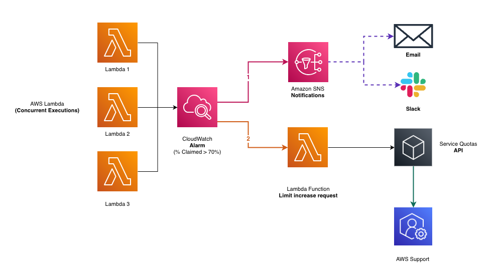
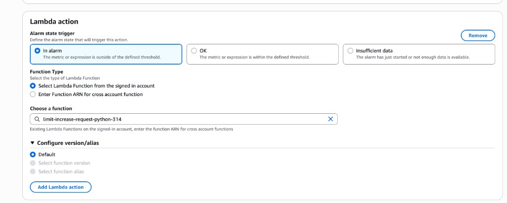

# CDK Solution: Monitoring + Automated Quota Increase



This folder contains CDK implementations (TypeScript and Python) that deploy the full monitoring stack from the article, plus an optional Lambda function that **automatically requests a quota increase** when the alarm fires.

Both implementations produce the same CloudFormation stack:

- CloudWatch metric math alarm on `% Claimed = (ClaimedAccountConcurrency / SERVICE_QUOTA(ConcurrentExecutions)) * 100`
- SNS topic for notifications (Email, Slack via AWS Chatbot)
- Lambda function that requests a bounded concurrency quota increase, then disables itself
- IAM permissions (including scoped `lambda:PutFunctionConcurrency`)
- CloudWatch alarm → Lambda + SNS actions

Versions:

- [`typescript/`](./typescript/) for the TypeScript CDK
- [`python/`](./python/) for the Python CDK

---

## Considerations

This automated quota increase is designed for healthy **organic traffic growth** in your region. Assess carefully before enabling.

**Automated increases only make sense when the consumer is healthy and the traffic is legitimate.** In every other case, throttling can benefit you and act as a circuit breaker.

Examples where increasing the limit will **not** help:

- **Reserved Concurrency over limit increases.** If you have multiple functions in the same region and on-demand traffic is not predictable, use reserved concurrency then consider an increase after you fully analyse how concurrency is distributed in your region.

- **Runaway error loops.** An erroring function without reserved concurrency. Raising the region limit just gives it more room to fail. Always check whether the function code is correct, or for example if the consumer is healthy before requesting more capacity. If it is broken, limit increase will cost you money.

- **Async invocations.** Synchronous invocations get throttled visibly. However, asynchronous invocations (CloudFormation custom resources, S3 triggers, EventBridge) are queued for up to 6 hours. For these, check `AsyncEventAge` and review the `MaximumEventAgeInSeconds` for critical async functions.

---

## Automated limit increase: how it works

The solution creates an alarm that triggers two independent actions:

- **SNS** → notifies your team (email, Slack)
- **Lambda** → requests a concurrency limit increase

The stack wires the Lambda function as a **direct CloudWatch alarm action**. When the alarm fires, the function automatically submits a Service Quotas increase request.

### The trade-off

Fully automating limit increases can generate extra cost, since it would keep driving your limit higher on every alarm transition.

To ensure a mitigation for a temporary pain, without creating additional headaches (if subsequent limit increases are not desired), this solution aims to create a function that runs one time only. Here is the idea:

1. The Lambda requests **one** bounded limit increase (current limit +10%).
2. Immediately after, the function **sets its own reserved concurrency to 0**. From Lambda's perspective this function is now un-invokable, so any future alarm action call is throttled for this specific function. Therefore, no new limit increases will be submitted.
3. SNS still keeps notifying the team on every alarm transition, so humans are always in the loop. However, the proportional first limit increase was applied or is in progress (if not automatically approved via Service Quotas).
4. A human review remains mandatory.

> If you prefer zero automation, just skip the Lambda action and keep only SNS.

### The Lambda function

The function uses the **Python 3.14** runtime. Once triggered, it checks for any pending quota increase requests and submits a new one if none exist. The requested value is proportional to the current limit (default: 10% increase). You can change the percentage via `INCREMENT_PERCENT`.

After a successful request, the function **disables itself by setting its own reserved concurrency to 0**. This turns the function into a one-shot safety net: the next alarm firing will not trigger another auto-increase until a human re-enables it. This is a deliberate pattern to avoid runaway auto-increases compounding cost or masking over-allocated reserved/provisioned concurrency.

> **How often will this Lambda get triggered?** CloudWatch Alarm actions trigger on **state transitions**, not continuously. The function is invoked **once** when the alarm transitions from `OK` to `In alarm`. It won't invoke again while the alarm stays in `ALARM` state. If the alarm recovers to `OK` and then breaches again, it invokes once more. Hence the solution with RC=0.

```python
import os
import boto3
import logging
import math

logger = logging.getLogger()
logger.setLevel(logging.INFO)

SERVICE_CODE = "lambda"
QUOTA_CODE = "L-B99A9384"  # Concurrent executions
INCREMENT_PERCENT = float(os.environ.get("INCREMENT_PERCENT", "0.10"))

quotas = boto3.client("service-quotas")
lambda_client = boto3.client("lambda")


def has_pending_request():
    paginator = quotas.get_paginator(
        "list_requested_service_quota_change_history_by_quota"
    )
    for page in paginator.paginate(ServiceCode=SERVICE_CODE, QuotaCode=QUOTA_CODE):
        for r in page.get("RequestedQuotas", []):
            if r["Status"] in ("PENDING", "CASE_OPENED"):
                return True
    return False


def throttle_self(function_name):
    """Set this function's reserved concurrency to 0 so future alarm
    invocations are throttled by Lambda itself. Re-enable with:
        aws lambda delete-function-concurrency --function-name <name>
    """
    lambda_client.put_function_concurrency(
        FunctionName=function_name,
        ReservedConcurrentExecutions=0,
    )
    logger.warning(
        f"Auto-increase DISABLED: set {function_name} RC=0. "
        f"A human must re-enable the function to allow future auto-increases."
    )


def lambda_handler(event, context):
    alarm_name = event.get("alarmData", {}).get("alarmName", "unknown")
    logger.info(f"Alarm triggered: {alarm_name}")

    if has_pending_request():
        logger.info("Skipping: a quota increase request is already pending")
        throttle_self(context.function_name)
        return {"status": "SKIPPED", "reason": "pending request exists"}

    current = quotas.get_service_quota(
        ServiceCode=SERVICE_CODE, QuotaCode=QUOTA_CODE
    )
    current_value = current["Quota"]["Value"]

    # Calculate proportional increase, rounded up
    increment = math.ceil(current_value * INCREMENT_PERCENT)
    desired_value = current_value + increment

    response = quotas.request_service_quota_increase(
        ServiceCode=SERVICE_CODE,
        QuotaCode=QUOTA_CODE,
        DesiredValue=desired_value,
    )

    status = response["RequestedQuota"]["Status"]
    logger.info(
        f"Requested increase: {current_value} -> {desired_value} "
        f"(+{increment}, {INCREMENT_PERCENT * 100:.0f}%) | Status: {status}"
    )

    # One-shot safety net: throttle so the next alarm requires a human decision
    throttle_self(context.function_name)

    return {
        "current": current_value,
        "desired": desired_value,
        "increment": increment,
        "increment_percent": INCREMENT_PERCENT * 100,
        "status": status,
    }
```

### IAM permissions for the execution role

```json
{
  "Version": "2012-10-17",
  "Statement": [
    {
      "Effect": "Allow",
      "Action": [
        "servicequotas:GetServiceQuota",
        "servicequotas:RequestServiceQuotaIncrease",
        "servicequotas:ListRequestedServiceQuotaChangeHistoryByQuota"
      ],
      "Resource": "*"
    },
    {
      "Sid": "SelfThrottleViaReservedConcurrency",
      "Effect": "Allow",
      "Action": "lambda:PutFunctionConcurrency",
      "Resource": "arn:aws:lambda:region:account-id:function:limit-increase-request"
    },
    {
      "Effect": "Allow",
      "Action": "iam:CreateServiceLinkedRole",
      "Resource": "arn:aws:iam::*:role/aws-service-role/servicequotas.amazonaws.com/*",
      "Condition": {
        "StringEquals": {
          "iam:AWSServiceName": "servicequotas.amazonaws.com"
        }
      }
    }
  ]
}
```

> The `lambda:PutFunctionConcurrency` resource ARN is scoped to this function only. Even if you use this IAM role somewhere else, it cannot invoke this IAM action for any other function.

### Adding the Lambda alarm action

Go back to your CloudWatch alarm → **Edit** → **Configure actions** → **Add Lambda action**. Select **In alarm** as the trigger state and choose your function:



The SNS action stays as-is for notifications. The Lambda action runs independently alongside it.

### Verifying the quota request

You can test the function by invoking it directly from the AWS Console. After you invoke it, go to **Service Quotas** → **Recent quota increase requests** and confirm if the limit increase request was sent/approved or a new Support Case was created.


That's it. When concurrency crosses 70%, the alarm fires, your team gets notified via SNS, and the Lambda function requests a limit increase. If the limit increase is not automatically approved, `Service Quotas` opens a support case in your account that will be assigned for human review.

### Re-enabling the function

Once the team gets the alarm and starts investigating, they can re-enable the limit increase function by removing the reserved concurrency setting. You can do this via [AWS console](https://docs.aws.amazon.com/lambda/latest/dg/configuration-concurrency.html#configuring-concurrency-reserved), or via CLI:

```bash
aws lambda delete-function-concurrency \
  --function-name limit-increase-request
```

To check current state:

```bash
aws lambda get-function-concurrency \
  --function-name limit-increase-request
```

`ReservedConcurrentExecutions: 0` means the function cannot be invoked. Removing this setting re-enables the automation.