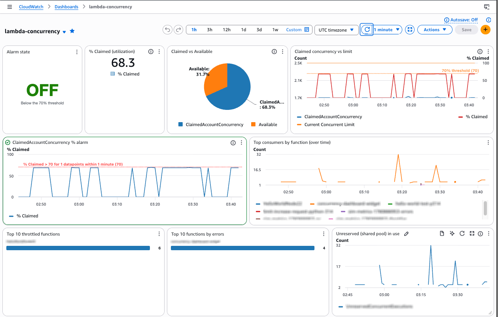
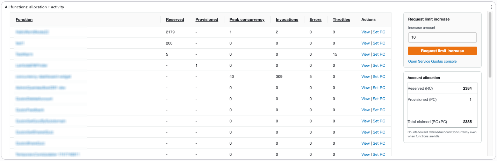
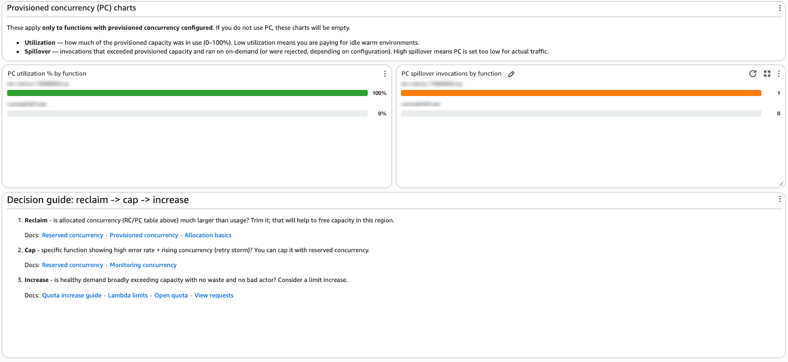

# Lambda Concurrency Dashboard

CDK app that deploys a CloudWatch dashboard for Lambda concurrency in your account/Region, plus a **% Claimed > 70% alarm** that notifies an SNS topic (notification only, no automated action).

## Dashboard preview

### Regional capacity, alarm, and top consumers



### Per-function allocation and activity



### Provisioned concurrency and decision guide



## Deploy

```bash
cd dashboard
npm install
npx cdk bootstrap   # once per account/Region
npx cdk deploy
```

Uses `CDK_DEFAULT_ACCOUNT` and `CDK_DEFAULT_REGION` from your environment.

To auto-subscribe an email to the alarm topic:

```bash
npx cdk deploy -c alertEmail=you@example.com
```

Open the dashboard: **CloudWatch → Dashboards → `lambda-concurrency`**

After the first deploy with `-c alertEmail=...`, confirm the SNS subscription via the confirmation email AWS sends you.

## Sample alarm email

When `% Claimed` crosses **70%**, CloudWatch publishes JSON to SNS. The email subject is set by AWS, for example:

```
ALARM: "lambda-concurrency-claimed-pct-70" in US East (N. Virginia)
```

The body is JSON. The human-readable part to read first is **`AlarmDescription`** (configured in CDK with a direct dashboard link and investigate-first guidance):

```
Lambda regional concurrency claimed has exceeded 70% of the account limit.

ClaimedAccountConcurrency = allocated RC/PC + unreserved executions in use.
New on-demand invocations may throttle soon if usage keeps climbing.

What to do:
1. Open the concurrency dashboard and identify top consumers / wasted RC.
2. Reclaim → cap → increase (do not raise the limit during a retry storm).

Dashboard: https://us-east-1.console.aws.amazon.com/cloudwatch/home?region=us-east-1#dashboards/dashboard/lambda-concurrency
Alarm: https://us-east-1.console.aws.amazon.com/cloudwatch/home?region=us-east-1#alarmsV2:alarm/lambda-concurrency-claimed-pct-70

---
State change: 2026-06-08T01:15:00.000+0000
Reason: Threshold Crossed: 1 datapoint [72.5 (08/06/26 01:14:00)] was greater than the threshold (70.0).
Region: us-east-1 | Account: 123456789012
```

Abbreviated JSON (what actually arrives in your inbox):

```json
{
  "AlarmName": "lambda-concurrency-claimed-pct-70",
  "AlarmDescription": "Lambda regional concurrency claimed has exceeded 70% ...\n\nDashboard: https://...\nAlarm: https://...",
  "NewStateValue": "ALARM",
  "NewStateReason": "Threshold Crossed: 1 datapoint [72.5 ...] was greater than the threshold (70.0).",
  "StateChangeTime": "2026-06-08T01:15:00.000+0000",
  "Region": "US-East-1",
  "AWSAccountId": "123456789012"
}
```

Replace `us-east-1` and account ID with your Region and account. URLs in the deployed alarm are built automatically from the stack Region.

## Resources this CDK deploys

| Resource | Name |
|---|---|
| CloudFormation stack | `LambdaConcurrencyDashboardStack` |
| CloudWatch dashboard | `lambda-concurrency` |
| CloudWatch alarm | `lambda-concurrency-claimed-pct-70` (% Claimed > 70%, SNS only) |
| SNS topic | `lambda-concurrency-alerts` |
| Lambda function | `concurrency-dashboard-widget` |
| CloudWatch log group | `/aws/lambda/concurrency-dashboard-widget` (7-day retention) |
| IAM role + policies | Lambda execution role, read access to Lambda and CloudWatch, Service Quotas on the quota button |
| Lambda permission | Allows CloudWatch to invoke the custom widget |

The alarm here is **notification only**. The optional auto-increase Lambda (`limit-increase-request`) lives in [`../auto-increase`](../auto-increase).

## Customize

| What | Where |
|---|---|
| Dashboard name, 70% threshold | [`lib/concurrency-dashboard-stack.ts`](lib/concurrency-dashboard-stack.ts) |
| Default quota increment (+10) | `DEFAULT_INCREMENT` in [`lambda/handler.py`](lambda/handler.py) |

## Destroy

```bash
npx cdk destroy
```
