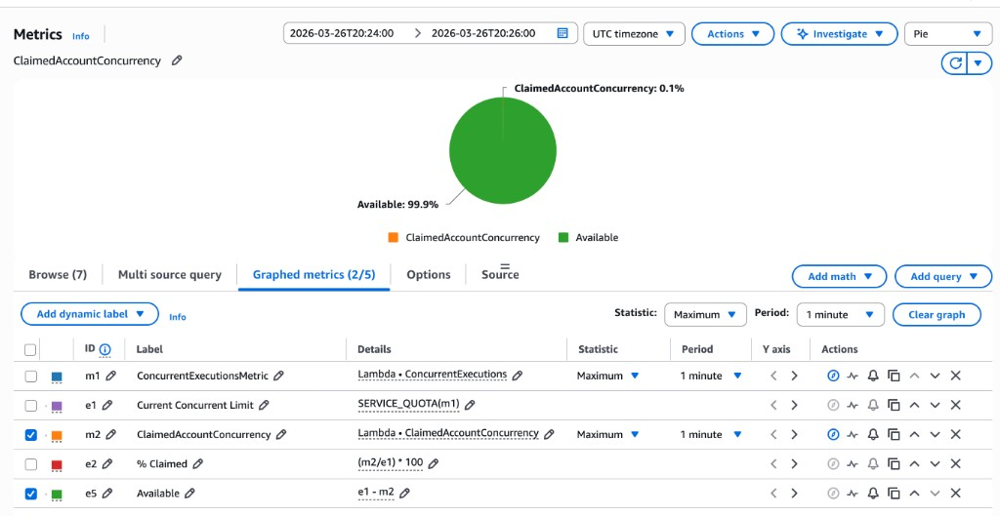
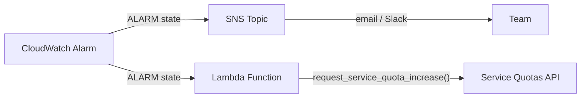

# AWS Lambda: Proactively Monitoring Concurrency with ClaimedAccountConcurrency

You use AWS Lambda and want to get notified when concurrency utilization reaches 70% — before throttling happens, not after.

This article covers just enough concurrency fundamentals to understand *why* `ClaimedAccountConcurrency` is the right metric, then walks through setting up a CloudWatch alarm step by step.

> **Note:** This guide uses the **AWS Console** intentionally. While production setups should use Infrastructure as Code (CloudFormation, CDK, Terraform), the console makes it easier to understand what each metric and configuration option does. Once you understand the concepts, translating to IaC is straightforward.

---

## Quick primer: how Lambda concurrency works

### One concurrent request = one execution environment

From [AWS documentation](https://docs.aws.amazon.com/lambda/latest/dg/lambda-concurrency.html):

> **Concurrency is the number of in-flight requests that your AWS Lambda function is handling at the same time.**

For each concurrent request, Lambda provisions a separate instance of your execution environment. Each environment handles **only one request at a time**. When it's busy (during both the Init and Invoke phases), it cannot accept other requests.

Lambda reuses environments when possible — a finished environment can handle the next request without re-initializing (warm start), which is faster than creating a new one (cold start).

### Visualizing concurrency

When multiple requests arrive simultaneously, Lambda spins up as many environments as needed. Draw a vertical line at any point in time, and count the active environments — that's your concurrency.


In this diagram, at the dashed green line there are **5 active environments**, so the concurrency at that moment is **5**. Requests 6–8 and 10 reuse environments that finished earlier (warm starts), while request 9 requires a new environment (cold start).

### Concurrency is regional and shared

Concurrency is **not per function**. All Lambda functions in an account share the same concurrency pool, scoped to a single AWS Region.

By default, every account gets **1,000 concurrent executions per Region** — a soft limit you can increase via [Service Quotas](https://docs.aws.amazon.com/servicequotas/latest/userguide/request-quota-increase.html).

> Lambda also enforces a **requests per second** limit equal to 10x your concurrency limit (e.g. 10,000 RPS at 1,000 concurrency). You can be throttled by request rate even if concurrency isn't maxed.

---

## Why ClaimedAccountConcurrency is the right metric

Lambda exposes several concurrency metrics in CloudWatch:

| Metric | What it measures |
|--------|-----------------|
| `ConcurrentExecutions` | Actively running invocations |
| `UnreservedConcurrentExecutions` | Invocations using the shared pool |
| `ClaimedAccountConcurrency` | Total concurrency **unavailable** for new on-demand invocations |

### The problem with ConcurrentExecutions

`ConcurrentExecutions` only counts what's **actively running**. It ignores concurrency that's been **allocated** through reserved or provisioned concurrency — capacity that's blocked from other functions even when idle.

### What ClaimedAccountConcurrency captures

```
ClaimedAccountConcurrency = UnreservedConcurrentExecutions + Allocated Concurrency
```

**Allocated concurrency** includes:

- **Reserved concurrency** — sets both a **floor and ceiling** for a function's concurrency. The function gets a guaranteed slice of the pool, but it also can't exceed that amount or use unreserved capacity. No other function can use it, even if the function is idle. No additional charge.
- **Provisioned concurrency** — pre-initializes environments to eliminate cold starts. Counts against the pool even when not processing requests. Incurs additional charges.

### Example: why this distinction matters

| Configuration | Value |
|--------------|-------|
| Account concurrency limit | 1,000 |
| Reserved concurrency (function A) | 400 |
| Reserved concurrency (function B) | 400 |
| Provisioned concurrency (function C) | 100 |
| Active executions (all within functions A, B, C) | 50 |

Since all 50 active executions are running within functions that have reserved or provisioned concurrency, `UnreservedConcurrentExecutions` is **0**. The allocated concurrency (400 + 400 + 100) is claimed regardless of actual usage:

- `ConcurrentExecutions` reports: **50**
- `ClaimedAccountConcurrency` reports: **900** (0 unreserved + 900 allocated)
- Actually available for new on-demand invocations: **100**

Only 50 invocations are running, but 900 units are claimed. If other functions spike, only 100 units remain before throttling. If any executions were running on *unreserved* functions, `ClaimedAccountConcurrency` would be even higher.

This is why Lambda uses `ClaimedAccountConcurrency` — not `ConcurrentExecutions` — to determine whether capacity is available.

---

## Setting up the CloudWatch alarm

### Step 1: Configure the metrics

1. Go to **CloudWatch** → **All metrics**
2. Click the **Source** tab
3. Paste the following JSON:

```json
{
  "metrics": [
    [ "AWS/Lambda", "ConcurrentExecutions", {
      "id": "m1", "yAxis": "left",
      "label": "ConcurrentExecutionsMetric", "visible": false
    }],
    [ { "expression": "SERVICE_QUOTA(m1)",
        "label": "Current Concurrent Limit",
        "id": "e1", "period": 60, "yAxis": "left",
        "color": "#9467bd"
    }],
    [ "AWS/Lambda", "ClaimedAccountConcurrency", {
      "id": "m2", "yAxis": "left", "color": "#ff7f0e"
    }],
    [ { "expression": "(m2/e1) * 100",
        "label": "% Claimed",
        "id": "e2", "period": 60, "yAxis": "left"
    }],
    [ { "expression": "e1 - m2",
        "label": "Available",
        "id": "e5", "period": 60, "yAxis": "left",
        "color": "#2ca02c"
    }]
  ],
  "sparkline": false,
  "view": "pie",
  "stacked": false,
  "region": "us-east-1",
  "period": 60,
  "stat": "Maximum",
  "liveData": false,
  "labels": { "visible": true },
  "legend": { "position": "bottom" }
}
```

4. Click **Update**

#### What each metric does

| ID | Type | Purpose |
|----|------|---------|
| `m1` | Metric | `ConcurrentExecutions` — used as input for `SERVICE_QUOTA()`. Hidden from the graph. |
| `e1` | Expression | `SERVICE_QUOTA(m1)` — dynamically fetches your actual regional concurrency limit |
| `m2` | Metric | `ClaimedAccountConcurrency` — the metric we want to monitor |
| `e2` | Expression | `(m2/e1) * 100` — utilization as a percentage |
| `e5` | Expression | `e1 - m2` — remaining available concurrency |

> **Why `SERVICE_QUOTA(m1)` instead of hardcoding 1,000?** The concurrency limit is a soft limit. If you've requested an increase, `SERVICE_QUOTA()` dynamically reflects your actual current limit — no need to update the alarm every time your quota changes.

### Step 2: Verify the metrics

After pasting the JSON and clicking **Update**, you should see the metrics table populated with all five entries. The table shows each metric's ID, label, details (source metric or expression), statistic, and period:



In the **Pie** view, select only `ClaimedAccountConcurrency` and `Available` (checkboxes on the left) to get an instant visual of how much of your concurrency pool is claimed vs. free.

Switch to the **Line** view and select all metrics to see the values over time. Hovering over the chart reveals the actual numbers at any point — here, the tooltip shows a `Current Concurrent Limit` of 1,000, `Available` at 999, `ClaimedAccountConcurrency` at 1, and `% Claimed` at 0.1%:


This confirms the metrics and expressions are working correctly before creating the alarm.

### Step 3: Create the alarm

1. Click the **bell icon** next to the `% Claimed` expression (`e2`)
2. Configure the alarm condition:

| Setting | Value | Why |
|---------|-------|-----|
| **Metric** | `% Claimed` (e2) | The utilization percentage we calculated |
| **Threshold type** | Static | Fixed threshold value |
| **Condition** | Greater than **70** | 70% gives headroom before hitting the limit |
| **Period** | 1 minute | Matches Lambda's metric emission granularity |
| **Statistic** | Maximum | Catches spikes — average would smooth them out |
| **Datapoints to alarm** | 1 out of 1 | Triggers on the first breach |

### Step 4: Configure actions

Configure an **SNS topic** as the notification target. This can deliver alerts via:

- Email
- Slack (via AWS Chatbot or a Lambda-backed integration)
- PagerDuty, Opsgenie, or any HTTP endpoint

### Step 5: Name the alarm

Give the alarm a descriptive name and optionally add a Markdown description (rendered in the CloudWatch console):


### Step 6: Review and create

Review the configuration and click **Create alarm**.

### Alarm in action

Once active, the alarm graph shows your utilization over time:

- **Blue line** → `% Claimed` utilization
- **Threshold** → 70%
- The alarm bar at the bottom transitions from **OK** (green) to **In alarm** (red) when the threshold is breached


---

## Going further: automate limit increases

Instead of just alerting, you can add a Lambda function as a **direct alarm action** that automatically submits a Service Quotas increase request. The alarm triggers two independent actions:

- **SNS** → notifies your team (email, Slack)
- **Lambda** → requests a concurrency limit increase



> **How often does the Lambda fire?** CloudWatch Alarm actions trigger on **state transitions**, not continuously. The function is invoked **once** when the alarm transitions from `OK` to `In alarm`. It won't fire again while the alarm stays in `ALARM` state. If the alarm recovers to `OK` and then breaches again, it fires once more — which is why the function includes an idempotency check to skip duplicate requests.

### The Lambda function

Create a new Lambda function with the **Python 3.14** runtime. This function receives the alarm event directly, checks for any pending quota increase requests, and submits a new one if none exist:

```python
import boto3
import logging

logger = logging.getLogger()
logger.setLevel(logging.INFO)

SERVICE_CODE = "lambda"
QUOTA_CODE = "L-B99A9384"  # Concurrent executions
INCREMENT = 500

client = boto3.client("service-quotas")


def has_pending_request():
    history = client.list_requested_service_quota_change_history_by_quota(
        ServiceCode=SERVICE_CODE, QuotaCode=QUOTA_CODE
    )
    return any(
        r["Status"] in ("PENDING", "CASE_OPENED")
        for r in history.get("RequestedQuotas", [])
    )


def lambda_handler(event, context):
    alarm_name = event.get("alarmData", {}).get("alarmName", "unknown")
    logger.info(f"Alarm triggered: {alarm_name}")

    if has_pending_request():
        logger.info("Skipping — a quota increase request is already pending")
        return {"status": "SKIPPED", "reason": "pending request exists"}

    current = client.get_service_quota(
        ServiceCode=SERVICE_CODE, QuotaCode=QUOTA_CODE
    )
    current_value = current["Quota"]["Value"]
    desired_value = current_value + INCREMENT

    response = client.request_service_quota_increase(
        ServiceCode=SERVICE_CODE,
        QuotaCode=QUOTA_CODE,
        DesiredValue=desired_value,
    )

    status = response["RequestedQuota"]["Status"]
    logger.info(
        f"Requested increase: {current_value} -> {desired_value} | Status: {status}"
    )

    return {
        "current": current_value,
        "desired": desired_value,
        "status": status,
    }
```

Key points about this function:

- `L-B99A9384` is the quota code for Lambda concurrent executions
- `INCREMENT = 500` adds 500 units on each trigger — adjust this to your needs
- `has_pending_request()` prevents duplicate submissions if the alarm oscillates between OK and ALARM before a previous request is approved
- `SERVICE_QUOTA()` in CloudWatch dynamically reflects the new limit after approval, so the alarm threshold adjusts automatically
- The event comes directly from the CloudWatch Alarm action (not via SNS), so the alarm name is at `event["alarmData"]["alarmName"]`
- No external dependencies — `boto3` is included in the Lambda runtime

### IAM permissions

Attach a policy to the function's execution role with the minimum required permissions:

```json
{
  "Version": "2012-10-17",
  "Statement": [
    {
      "Effect": "Allow",
      "Action": [
        "servicequotas:GetServiceQuota",
        "servicequotas:RequestServiceQuotaIncrease",
        "servicequotas:ListRequestedServiceQuotaChangeHistoryByQuota"
      ],
      "Resource": "*"
    },
    {
      "Effect": "Allow",
      "Action": "iam:CreateServiceLinkedRole",
      "Resource": "arn:aws:iam::*:role/aws-service-role/servicequotas.amazonaws.com/*",
      "Condition": {
        "StringEquals": {
          "iam:AWSServiceName": "servicequotas.amazonaws.com"
        }
      }
    }
  ]
}
```

### Wiring it up in the console

1. **Create the function:** Go to **Lambda** → **Create function** → Author from scratch. Name it (e.g. `limit-increase-request-python-314`), select **Python 3.14** as the runtime, and paste the code above.
2. **Attach the IAM policy:** Go to the function's **Configuration** → **Permissions** → click the execution role → **Add permissions** → **Create inline policy** → paste the JSON above.
3. **Grant CloudWatch permission to invoke the function.** CloudWatch Alarms use a specific service principal and need explicit permission on the Lambda function. Run:

```bash
aws lambda add-permission \
  --function-name "limit-increase-request-python-314" \
  --statement-id "AllowCloudWatchAlarmInvoke" \
  --action "lambda:InvokeFunction" \
  --principal "lambda.alarms.cloudwatch.amazonaws.com" \
  --source-arn "arn:aws:cloudwatch:<REGION>:<ACCOUNT_ID>:alarm:<ALARM_NAME>"
```

Replace `<REGION>`, `<ACCOUNT_ID>`, and `<ALARM_NAME>` with your values. Without this, CloudWatch will silently fail to invoke the function.

4. **Add the Lambda alarm action:** Go back to your CloudWatch alarm → **Edit** → **Configure actions** → **Add Lambda action**. Select **In alarm** as the trigger state and choose your function:


The SNS action you configured in Step 4 stays as-is for notifications. The Lambda action runs independently alongside it.

### Verify the quota request and support case

After a successful invocation, go to **Service Quotas** → **Recent quota increase requests** and confirm a new request appears for **AWS Lambda / Concurrent executions** with status like **Case Opened**:


Click the support case ID to open the case details page and confirm the request metadata (subject, status, category, and creation time):


That's it. When concurrency crosses 70%, the alarm fires, your team gets notified via SNS, the Lambda function requests a limit increase, and AWS opens a support case for quota review — turning your monitoring from reactive into proactive.

---

## Key takeaways

- **Concurrency** = number of execution environments active at the same time
- Concurrency is **regional** and **shared** across all functions in the account
- `ConcurrentExecutions` only shows active invocations — it misses reserved and provisioned capacity
- `ClaimedAccountConcurrency` reflects **real capacity usage**, which is what Lambda uses to determine availability
- `SERVICE_QUOTA()` dynamically fetches your actual limit — don't hardcode it
- Set alarms at **70%** to give yourself time to react before throttling

---

*References: [AWS Lambda — Understanding function scaling](https://docs.aws.amazon.com/lambda/latest/dg/lambda-concurrency.html) · [Monitoring concurrency](https://docs.aws.amazon.com/lambda/latest/dg/monitoring-concurrency.html)*
