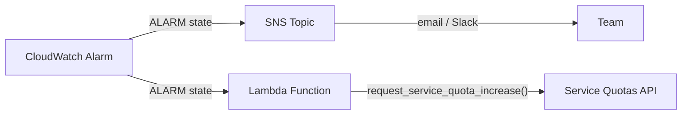

# AWS Lambda: Proactively Monitoring Concurrency with ClaimedAccountConcurrency


## What is AWS Lambda?

AWS Lambda is a compute service that runs your code in response to events (API requests, queue messages, file uploads) without requiring you to manage servers. It scales automatically as traffic increases.

## The problem

When you scale serverless architectures, observability gets noisy fast. Dozens of metrics, dashboards per function, alarms on individual errors. Then one night at 3am you get an alert: regional concurrency limit reached. Requests are being dropped across the entire account. Which metric should you have been watching? What could you have done before it got to this point?

The answer is `ClaimedAccountConcurrency`: the one metric that reflects how much of your regional capacity is truly unavailable for new invocations. This guide shows you how to monitor it and set up an alarm that fires at 70% utilization, giving you time to react before throttling begins.

**Topics:**

1. How Lambda concurrency works (just enough to understand the metric choice)
2. Why `ClaimedAccountConcurrency` is the right metric to monitor
3. Setting up a CloudWatch alarm step by step
4. Automating quota increases when the alarm fires

**Note:** This guide uses the **AWS Console** intentionally. While Infrastructure as Code (CloudFormation, CDK, Terraform) is more efficient, console-first instructions make the concepts easier to learn. Once you understand the mechanics, translating to IaC is straightforward. A CDK example ready for deployment is available in [`./infrastructure/cdk`](./infrastructure/cdk).

---

## How Lambda concurrency works

Before building the alarm, you need to understand how Lambda allocates capacity and where the limits come from.

From [AWS documentation](https://docs.aws.amazon.com/lambda/latest/dg/lambda-concurrency.html):

> **Concurrency is the number of in-flight requests that your AWS Lambda function is handling at the same time.**

Each execution environment handles one request at a time. If an environment is busy (during both the Init and Invoke phases), Lambda provisions another. When an environment finishes processing, it can serve the next request without re-initializing (warm start).

When multiple requests arrive simultaneously, Lambda spins up as many environments as needed. Draw a vertical line at any point in time and count the active environments. That number is your concurrency at that moment.


In the diagram above, at the dashed green line there are **5 active environments**, so the concurrency at that moment is **5**. Requests 6 through 8 and 10 reuse environments that finished earlier (warm starts), while request 9 requires a new environment (cold start).

### Concurrency is regional and shared

Concurrency is **not per function**. All Lambda functions in an account share the same concurrency pool, scoped to a single AWS Region.

By default, every account gets **1,000 concurrent executions per Region**. This is a soft limit you can increase via [Service Quotas](https://docs.aws.amazon.com/servicequotas/latest/userguide/request-quota-increase.html).

Lambda also enforces a **requests per second** limit equal to 10x your concurrency limit (e.g. 10,000 RPS at 1,000 concurrency). You can be throttled by request rate even if concurrency is not maxed out.

> **Good to know:** When your regional concurrency limit is hit, throttling affects **everything** using Lambda in that account and Region. Not just your API functions. SQS consumers, Kinesis stream pollers, DynamoDB Streams processors, EventBridge targets, scheduled jobs. Every team and every service relying on Lambda in that Region gets impacted simultaneously.

---

## Why ClaimedAccountConcurrency is the right metric

Now that we know concurrency is shared and finite, the question becomes: which metric actually tells us how close we are to the limit?

Lambda exposes three concurrency metrics in CloudWatch:

| Metric                           | What it measures                                                |
| -------------------------------- | --------------------------------------------------------------- |
| `ConcurrentExecutions`           | Actively running invocations                                    |
| `UnreservedConcurrentExecutions` | Invocations using the shared (unreserved) pool                  |
| `ClaimedAccountConcurrency`      | Total concurrency **unavailable** for new on-demand invocations |

Looking at these three metrics, the intuitive choice seems obvious: just track `ConcurrentExecutions` and you are done. Not quite.

### Why ConcurrentExecutions is not enough

`ConcurrentExecutions` only counts what is **actively running**. It ignores concurrency that has been **allocated** through reserved or provisioned concurrency. That allocated capacity is blocked from other functions even when idle, so the real available capacity is lower than `ConcurrentExecutions` suggests.

### What ClaimedAccountConcurrency captures

```
ClaimedAccountConcurrency = UnreservedConcurrentExecutions + Allocated Concurrency
```

**Allocated concurrency** is the sum of:

- **Reserved concurrency (RC)** across all functions in the Region. Reserved concurrency sets both a guaranteed minimum and a hard maximum for a function. The function gets a dedicated slice of the pool, but it cannot exceed that amount or use unreserved capacity. No other function can use it, even when idle. No additional charge.
- **Provisioned concurrency (PC)** across functions that do **not** have reserved concurrency. Provisioned concurrency pre-initializes environments to eliminate cold starts. These environments count against the pool even when not processing requests. Incurs additional charges.

> **Important:** If a function has **both** RC and PC, Lambda only counts RC toward allocated concurrency (since RC is always >= PC for a given function). This avoids double-counting. In the example below, each function uses one or the other, so the values simply add up.

### Scenario 1: small account, almost full

| Configuration                                              | Value |
| ---------------------------------------------------------- | ----- |
| Account concurrency limit                                  | 10    |
| Reserved concurrency (function A)                          | 3     |
| Reserved concurrency (function B)                          | 3     |
| Provisioned concurrency (function C, no RC)                | 2     |
| Active executions (unreserved, function D)                 | 1     |

`ClaimedAccountConcurrency` = 1 (unreserved) + 8 (allocated: 3 + 3 + 2) = **9**. Only **1** unit of capacity remains for new invocations.


### Scenario 2: production account at steady state

| Configuration                                              | Value |
| ---------------------------------------------------------- | ----- |
| Account concurrency limit                                  | 1,000 |
| Reserved concurrency (function A)                          | 400   |
| Reserved concurrency (function B)                          | 400   |
| Provisioned concurrency (function C, no RC)                | 100   |
| Active executions (unreserved, across functions D, E, F)   | 60    |

```
ClaimedAccountConcurrency = 60 (unreserved) + 900 (allocated: 400 + 400 + 100) = 960
```

Only 60 on-demand invocations are running, but 900 additional units are allocated. Total claimed is **960**. Available for new invocations: **40**.


### Scenario 3: traffic spike causes throttling

Using the same account from Scenario 2, a sudden spike hits. Functions G, H, and I receive **150 new concurrent requests** on unreserved concurrency. At that point, only **40** units are available.

```
Available = Regional limit - ClaimedAccountConcurrency
Available = 1,000 - 960 = 40

Throttled = New requests - Available
Throttled = 150 - 40 = 110
```

Only **40** of the 150 requests can run immediately. The remaining **110** are throttled (visible in the `Throttles` metric).


This is why Lambda uses `ClaimedAccountConcurrency`, not `ConcurrentExecutions`, to determine whether capacity is available.

---

## Setting up the CloudWatch alarm

With the right metric identified, let's wire it into a CloudWatch alarm that fires before throttling begins.

### Step 1: Configure the metrics

1. Go to **CloudWatch** → **All metrics**
2. Click the **Source** tab
3. Paste the following JSON:

```json
{
  "metrics": [
    [
      "AWS/Lambda",
      "ConcurrentExecutions",
      {
        "id": "m1",
        "yAxis": "left",
        "label": "ConcurrentExecutionsMetric",
        "visible": false
      }
    ],
    [
      {
        "expression": "SERVICE_QUOTA(m1)",
        "label": "Current Concurrent Limit",
        "id": "e1",
        "period": 60,
        "yAxis": "left",
        "color": "#9467bd"
      }
    ],
    [
      "AWS/Lambda",
      "ClaimedAccountConcurrency",
      {
        "id": "m2",
        "yAxis": "left",
        "color": "#ff7f0e"
      }
    ],
    [
      {
        "expression": "(m2/e1) * 100",
        "label": "% Claimed",
        "id": "e2",
        "period": 60,
        "yAxis": "left"
      }
    ],
    [
      {
        "expression": "e1 - m2",
        "label": "Available",
        "id": "e5",
        "period": 60,
        "yAxis": "left",
        "color": "#2ca02c"
      }
    ]
  ],
  "sparkline": false,
  "view": "pie",
  "stacked": false,
  "region": "us-east-1",
  "period": 60,
  "stat": "Maximum",
  "liveData": false,
  "labels": { "visible": true },
  "legend": { "position": "bottom" }
}
```

4. Click **Update**

#### What each metric does

| ID   | Type       | Purpose                                                                        |
| ---- | ---------- | ------------------------------------------------------------------------------ |
| `m1` | Metric     | `ConcurrentExecutions`, used as input for `SERVICE_QUOTA()`. Hidden from graph |
| `e1` | Expression | `SERVICE_QUOTA(m1)`, dynamically fetches your actual regional concurrency limit |
| `m2` | Metric     | `ClaimedAccountConcurrency`, the metric we want to monitor                     |
| `e2` | Expression | `(m2/e1) * 100`, utilization as a percentage                                   |
| `e5` | Expression | `e1 - m2`, remaining available concurrency                                     |

> **Why `SERVICE_QUOTA(m1)` instead of hardcoding 1,000?** The concurrency limit is a soft limit. If you request an increase, `SERVICE_QUOTA()` dynamically reflects your actual current limit. No need to update the alarm every time your quota changes.

### Step 2: Verify the metrics

After pasting the JSON and clicking **Update**, you should see the metrics table populated with all five entries. The table shows each metric's ID, label, details (source metric or expression), statistic, and period:


In the **Pie** view, select only `ClaimedAccountConcurrency` and `Available` (checkboxes on the left) to get an instant visual of how much of your concurrency pool is claimed vs. free.

Switch to the **Line** view and select all metrics to see the values over time. Hovering over the chart reveals the actual numbers at any point. Here, the tooltip shows a `Current Concurrent Limit` of 1,000, `Available` at 999, `ClaimedAccountConcurrency` at 1, and `% Claimed` at 0.1%:


This confirms the metrics and expressions are working correctly before creating the alarm.

### Step 3: Create the alarm

1. Click the **bell icon** next to the `% Claimed` expression (`e2`)
2. Configure the alarm condition:

| Setting                 | Value               | Why                                                     |
| ----------------------- | ------------------- | ------------------------------------------------------- |
| **Metric**              | `% Claimed` (e2)    | The utilization percentage we calculated                |
| **Threshold type**      | Static              | Fixed threshold value                                   |
| **Condition**           | Greater than **70** | 70% gives headroom before hitting the limit             |
| **Period**              | 1 minute            | Matches Lambda's metric emission granularity            |
| **Statistic**           | Maximum             | Catches spikes (average would smooth them out)          |
| **Datapoints to alarm** | 1 out of 1          | Triggers on the first breach                            |

### Step 4: Configure actions

Configure an **SNS topic** as the notification target. This can deliver alerts via:

- Email
- Slack (via AWS Chatbot or a Lambda-backed integration)
- PagerDuty, Opsgenie, or any HTTP endpoint

### Step 5: Name the alarm

Give the alarm a descriptive name and optionally add a Markdown description (rendered in the CloudWatch console):


### Step 6: Review and create

Review the configuration and click **Create alarm**.

### Alarm in action

Once active, the alarm graph shows your utilization over time:

- **Blue line** → `% Claimed` utilization
- **Threshold** → 70%
- The alarm bar at the bottom transitions from **OK** (green) to **In alarm** (red) when the threshold is breached


---

## Going further: automate limit increases

The alarm tells you there is a problem. The next step is fixing it automatically.

Instead of only alerting, you can add a Lambda function as a **direct alarm action** that automatically submits a Service Quotas increase request. The alarm triggers two independent actions:

- **SNS** → notifies your team (email, Slack)
- **Lambda** → requests a concurrency limit increase



> **How often does the Lambda fire?** CloudWatch Alarm actions trigger on **state transitions**, not continuously. The function is invoked **once** when the alarm transitions from `OK` to `In alarm`. It will not fire again while the alarm stays in `ALARM` state. If the alarm recovers to `OK` and then breaches again, it fires once more. This is why the function includes an idempotency check to skip duplicate requests.

> **Important caveat:** Quota increases are not instant. AWS reviews and approves them manually, which can take hours or days. This automation gets the request submitted immediately, but it does not provide more capacity right away. Treat it as a proactive request mechanism, not a real-time scaling solution.

### The Lambda function

Create a new Lambda function with the **Python 3.13** runtime. This function receives the alarm event directly, checks for any pending quota increase requests, and submits a new one if none exist:

```python
import boto3
import logging

logger = logging.getLogger()
logger.setLevel(logging.INFO)

SERVICE_CODE = "lambda"
QUOTA_CODE = "L-B99A9384"  # Concurrent executions
INCREMENT = 500

client = boto3.client("service-quotas")

def has_pending_request():
    history = client.list_requested_service_quota_change_history_by_quota(
        ServiceCode=SERVICE_CODE, QuotaCode=QUOTA_CODE
    )
    return any(
        r["Status"] in ("PENDING", "CASE_OPENED")
        for r in history.get("RequestedQuotas", [])
    )

def lambda_handler(event, context):
    alarm_name = event.get("alarmData", {}).get("alarmName", "unknown")
    logger.info(f"Alarm triggered: {alarm_name}")

    if has_pending_request():
        logger.info("Skipping: a quota increase request is already pending")
        return {"status": "SKIPPED", "reason": "pending request exists"}

    current = client.get_service_quota(
        ServiceCode=SERVICE_CODE, QuotaCode=QUOTA_CODE
    )
    current_value = current["Quota"]["Value"]
    desired_value = current_value + INCREMENT

    response = client.request_service_quota_increase(
        ServiceCode=SERVICE_CODE,
        QuotaCode=QUOTA_CODE,
        DesiredValue=desired_value,
    )

    status = response["RequestedQuota"]["Status"]
    logger.info(
        f"Requested increase: {current_value} -> {desired_value} | Status: {status}"
    )

    return {
        "current": current_value,
        "desired": desired_value,
        "status": status,
    }
```

Key points about this function:

- `L-B99A9384` is the quota code for Lambda concurrent executions
- `INCREMENT = 500` adds 500 units on each trigger. Adjust this to your needs
- `has_pending_request()` prevents duplicate submissions if the alarm oscillates between OK and ALARM before a previous request is approved
- `SERVICE_QUOTA()` in CloudWatch dynamically reflects the new limit after approval, so the alarm threshold adjusts automatically
- The event comes directly from the CloudWatch Alarm action (not via SNS), so the alarm name is at `event["alarmData"]["alarmName"]`
- No external dependencies. `boto3` is included in the Lambda runtime

### IAM permissions

Attach a policy to the function's execution role with the minimum required permissions:

```json
{
  "Version": "2012-10-17",
  "Statement": [
    {
      "Effect": "Allow",
      "Action": [
        "servicequotas:GetServiceQuota",
        "servicequotas:RequestServiceQuotaIncrease",
        "servicequotas:ListRequestedServiceQuotaChangeHistoryByQuota"
      ],
      "Resource": "*"
    },
    {
      "Effect": "Allow",
      "Action": "iam:CreateServiceLinkedRole",
      "Resource": "arn:aws:iam::*:role/aws-service-role/servicequotas.amazonaws.com/*",
      "Condition": {
        "StringEquals": {
          "iam:AWSServiceName": "servicequotas.amazonaws.com"
        }
      }
    }
  ]
}
```

### Wiring it up in the console

1. **Create the function:** Go to **Lambda** → **Create function** → Author from scratch. Name it (e.g. `limit-increase-request`), select **Python 3.13** as the runtime, and paste the code above.

2. **Attach the IAM policy:** Go to the function's **Configuration** → **Permissions** → click the execution role → **Add permissions** → **Create inline policy** → paste the JSON above.

3. **Grant CloudWatch permission to invoke the function.** CloudWatch Alarms use a specific service principal and need explicit permission on the Lambda function. Run:

```bash
aws lambda add-permission \
  --function-name "limit-increase-request" \
  --statement-id "AllowCloudWatchAlarmInvoke" \
  --action "lambda:InvokeFunction" \
  --principal "lambda.alarms.cloudwatch.amazonaws.com" \
  --source-arn "arn:aws:cloudwatch:<REGION>:<ACCOUNT_ID>:alarm:<ALARM_NAME>"
```

Replace `<REGION>`, `<ACCOUNT_ID>`, and `<ALARM_NAME>` with your values. Without this, CloudWatch will silently fail to invoke the function.

4. **Add the Lambda alarm action:** Go back to your CloudWatch alarm → **Edit** → **Configure actions** → **Add Lambda action**. Select **In alarm** as the trigger state and choose your function:


The SNS action you configured in Step 4 stays as-is for notifications. The Lambda action runs independently alongside it.

### Verify the quota request and support case

After a successful invocation, go to **Service Quotas** → **Recent quota increase requests** and confirm a new request appears for **AWS Lambda / Concurrent executions** with a status like **Case Opened**:


Click the support case ID to open the case details page and confirm the request metadata (subject, status, category, and creation time):


That covers the full setup. When concurrency crosses 70%, the alarm fires. Your team gets notified via SNS. The Lambda function requests a limit increase. AWS opens a support case for quota review. Monitoring becomes proactive instead of reactive.

---

## Key takeaways

- **Concurrency** = number of execution environments active at the same time
- Concurrency is **regional** and **shared** across all functions in the same account and region
- `ConcurrentExecutions` only shows active invocations. It misses reserved and provisioned capacity
- `ClaimedAccountConcurrency` reflects **real capacity usage**, which is what Lambda uses to determine availability
- `SERVICE_QUOTA()` dynamically fetches your actual limit. Do not hardcode it
- Set alarms at **70%** to give yourself time to react before throttling
- Quota increases are not instant. Combine the automated request with alerting so your team can also take manual action if needed

---

_References: [AWS Lambda: Understanding function scaling](https://docs.aws.amazon.com/lambda/latest/dg/lambda-concurrency.html) · [Monitoring concurrency](https://docs.aws.amazon.com/lambda/latest/dg/monitoring-concurrency.html)_
