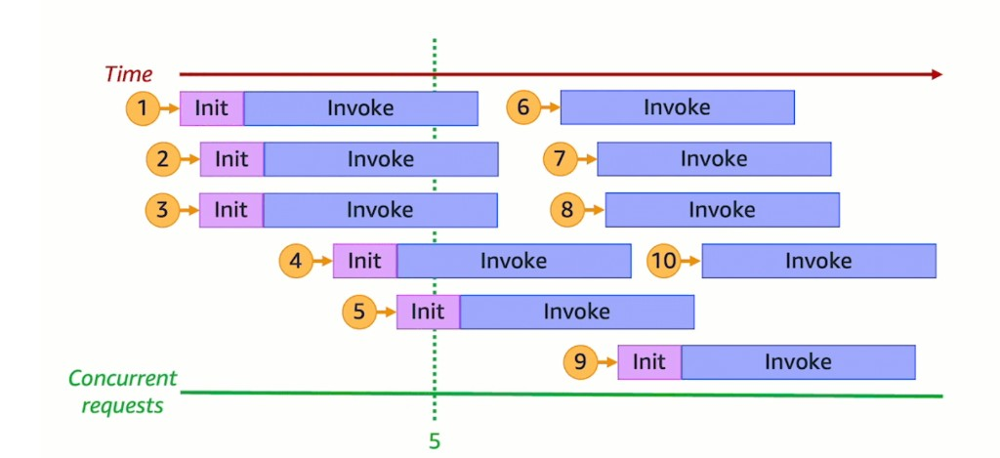
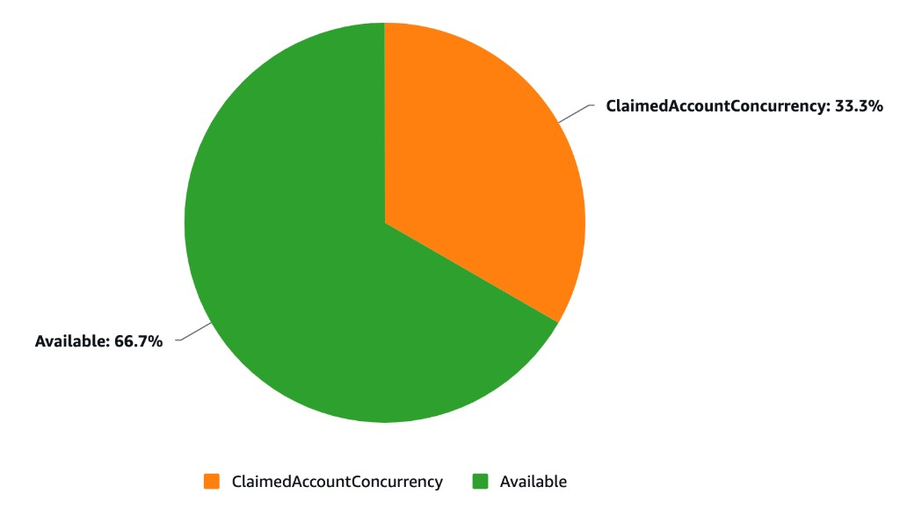
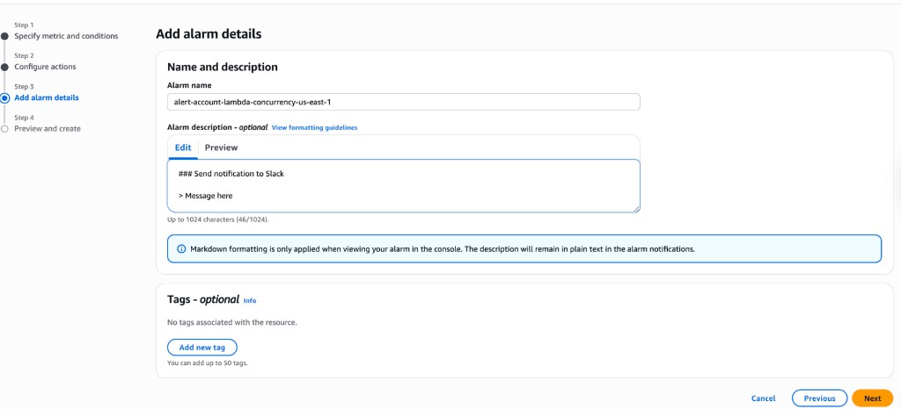
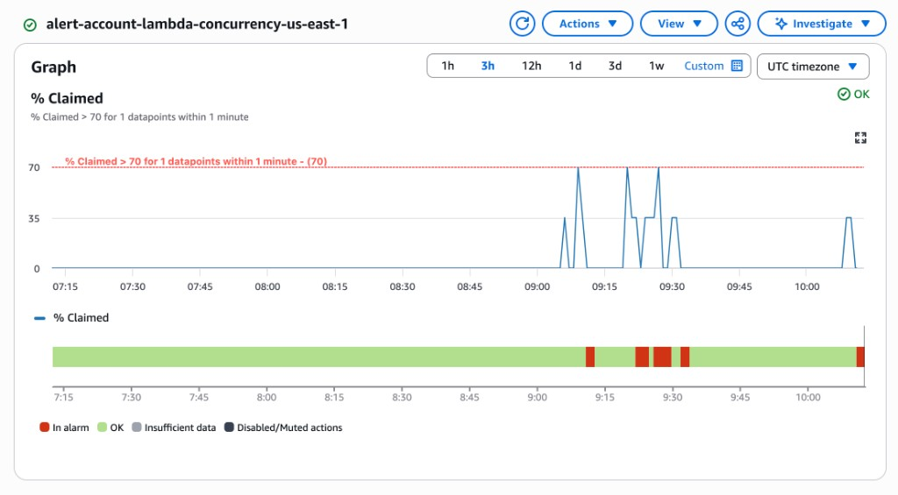

# AWS Lambda: Proactively Monitoring Concurrency with ClaimedAccountConcurrency

You use AWS Lambda and want to get notified when concurrency utilization reaches 70% — before throttling happens, not after.

This article covers just enough concurrency fundamentals to understand *why* `ClaimedAccountConcurrency` is the right metric, then walks through setting up a CloudWatch alarm step by step.

> **Note:** This guide uses the **AWS Console** intentionally. While production setups should use Infrastructure as Code (CloudFormation, CDK, Terraform), the console makes it easier to understand what each metric and configuration option does. Once you understand the concepts, translating to IaC is straightforward.

---

## Quick primer: how Lambda concurrency works

### One request = one execution environment

From [AWS documentation](https://docs.aws.amazon.com/lambda/latest/dg/lambda-concurrency.html):

> **Concurrency is the number of in-flight requests that your AWS Lambda function is handling at the same time.**

For each concurrent request, Lambda provisions a separate instance of your execution environment. Each environment handles **only one request at a time**. When it's busy (during both the Init and Invoke phases), it cannot accept other requests.

Lambda reuses environments when possible — a finished environment can handle the next request without re-initializing (warm start), which is faster than creating a new one (cold start).

### Visualizing concurrency

When multiple requests arrive simultaneously, Lambda spins up as many environments as needed. Draw a vertical line at any point in time, and count the active environments — that's your concurrency.



In this diagram, at the dashed green line there are **5 active environments**, so the concurrency at that moment is **5**. Requests 6–8 and 10 reuse environments that finished earlier (warm starts), while request 9 requires a new environment (cold start).

### Concurrency is regional and shared

Concurrency is **not per function**. All Lambda functions in an account share the same concurrency pool, scoped to a single AWS Region.

By default, every account gets **1,000 concurrent executions per Region** — a soft limit you can increase via [Service Quotas](https://docs.aws.amazon.com/servicequotas/latest/userguide/request-quota-increase.html).

> Lambda also enforces a **requests per second** limit equal to 10x your concurrency limit (e.g. 10,000 RPS at 1,000 concurrency). You can be throttled by request rate even if concurrency isn't maxed.

---

## Why ClaimedAccountConcurrency is the right metric

Lambda exposes several concurrency metrics in CloudWatch:

| Metric | What it measures |
|--------|-----------------|
| `ConcurrentExecutions` | Actively running invocations |
| `UnreservedConcurrentExecutions` | Invocations using the shared pool |
| `ClaimedAccountConcurrency` | Total concurrency **unavailable** for new on-demand invocations |

### The problem with ConcurrentExecutions

`ConcurrentExecutions` only counts what's **actively running**. It ignores concurrency that's been **allocated** through reserved or provisioned concurrency — capacity that's blocked from other functions even when idle.

### What ClaimedAccountConcurrency captures

```
ClaimedAccountConcurrency = UnreservedConcurrentExecutions + Allocated Concurrency
```

**Allocated concurrency** includes:

- **Reserved concurrency** — dedicates a fixed slice of the pool to a function. No other function can use it, even if the function is idle. No additional charge.
- **Provisioned concurrency** — pre-initializes environments to eliminate cold starts. Counts against the pool even when not processing requests. Incurs additional charges.

### Example: why this distinction matters

| Configuration | Value |
|--------------|-------|
| Account concurrency limit | 1,000 |
| Reserved concurrency (function A) | 400 |
| Reserved concurrency (function B) | 400 |
| Provisioned concurrency (function C) | 100 |
| Active executions right now | 50 |

- `ConcurrentExecutions` reports: **50**
- `ClaimedAccountConcurrency` reports: **900**
- Actually available for new on-demand invocations: **100**

Only 50 invocations are running, but 900 units are claimed. If a spike hits, only 100 units remain before throttling. This is why Lambda uses `ClaimedAccountConcurrency` — not `ConcurrentExecutions` — to determine whether capacity is available.

---

## Setting up the CloudWatch alarm

### Step 1: Configure the metrics

1. Go to **CloudWatch** → **All metrics**
2. Click the **Source** tab
3. Paste the following JSON:

```json
{
  "metrics": [
    [ "AWS/Lambda", "ConcurrentExecutions", {
      "id": "m1", "yAxis": "left",
      "label": "ConcurrentExecutionsMetric", "visible": false
    }],
    [ { "expression": "SERVICE_QUOTA(m1)",
        "label": "Current Concurrent Limit",
        "id": "e1", "period": 60, "yAxis": "left",
        "color": "#9467bd"
    }],
    [ "AWS/Lambda", "ClaimedAccountConcurrency", {
      "id": "m2", "yAxis": "left", "color": "#ff7f0e"
    }],
    [ { "expression": "(m2/e1) * 100",
        "label": "% Claimed",
        "id": "e2", "period": 60, "yAxis": "left"
    }],
    [ { "expression": "e1 - m2",
        "label": "Available",
        "id": "e5", "period": 60, "yAxis": "left",
        "color": "#2ca02c"
    }]
  ],
  "sparkline": false,
  "view": "pie",
  "stacked": false,
  "region": "us-east-1",
  "period": 60,
  "stat": "Maximum",
  "liveData": false,
  "labels": { "visible": true },
  "legend": { "position": "bottom" }
}
```

4. Click **Update**

#### What each metric does

| ID | Type | Purpose |
|----|------|---------|
| `m1` | Metric | `ConcurrentExecutions` — used as input for `SERVICE_QUOTA()`. Hidden from the graph. |
| `e1` | Expression | `SERVICE_QUOTA(m1)` — dynamically fetches your actual regional concurrency limit |
| `m2` | Metric | `ClaimedAccountConcurrency` — the metric we want to monitor |
| `e2` | Expression | `(m2/e1) * 100` — utilization as a percentage |
| `e5` | Expression | `e1 - m2` — remaining available concurrency |

> **Why `SERVICE_QUOTA(m1)` instead of hardcoding 1,000?** The concurrency limit is a soft limit. If you've requested an increase, `SERVICE_QUOTA()` dynamically reflects your actual current limit — no need to update the alarm every time your quota changes.

### Step 2: Verify with the Pie chart view

Switch the view to **Pie** and select only `ClaimedAccountConcurrency` and `Available` to get an instant visual of your capacity split:



### Step 3: Create the alarm

1. Click the **bell icon** next to the `% Claimed` expression (`e2`)
2. Configure the alarm condition:

| Setting | Value | Why |
|---------|-------|-----|
| **Metric** | `% Claimed` (e2) | The utilization percentage we calculated |
| **Threshold type** | Static | Fixed threshold value |
| **Condition** | Greater than **70** | 70% gives headroom before hitting the limit |
| **Period** | 1 minute | Matches Lambda's metric emission granularity |
| **Statistic** | Maximum | Catches spikes — average would smooth them out |
| **Datapoints to alarm** | 1 out of 1 | Triggers on the first breach |

### Step 4: Configure actions

Configure an **SNS topic** as the notification target. This can deliver alerts via:

- Email
- Slack (via AWS Chatbot or a Lambda-backed integration)
- PagerDuty, Opsgenie, or any HTTP endpoint

### Step 5: Name the alarm

Give the alarm a descriptive name and optionally add a Markdown description (rendered in the CloudWatch console):



### Step 6: Review and create

Review the configuration and click **Create alarm**.

### Alarm in action

Once active, the alarm graph shows your utilization over time:

- **Blue line** → `% Claimed` utilization
- **Threshold** → 70%
- The alarm bar at the bottom transitions from **OK** (green) to **In alarm** (red) when the threshold is breached



---

## Going further: automate limit increases

Instead of just alerting, you can make this event-driven. When the alarm transitions to `ALARM` state, use the SNS notification to trigger a Lambda function that automatically submits a Service Quotas increase request via the AWS SDK.

This turns your monitoring from reactive ("we got throttled") into proactive ("concurrency is at 70%, let's scale before it becomes a problem").

---

## Key takeaways

- **Concurrency** = number of execution environments active at the same time
- Concurrency is **regional** and **shared** across all functions in the account
- `ConcurrentExecutions` only shows active invocations — it misses reserved and provisioned capacity
- `ClaimedAccountConcurrency` reflects **real capacity usage**, which is what Lambda uses to determine availability
- `SERVICE_QUOTA()` dynamically fetches your actual limit — don't hardcode it
- Set alarms at **70%** to give yourself time to react before throttling

---

*References: [AWS Lambda — Understanding function scaling](https://docs.aws.amazon.com/lambda/latest/dg/lambda-concurrency.html) · [Monitoring concurrency](https://docs.aws.amazon.com/lambda/latest/dg/monitoring-concurrency.html)*
