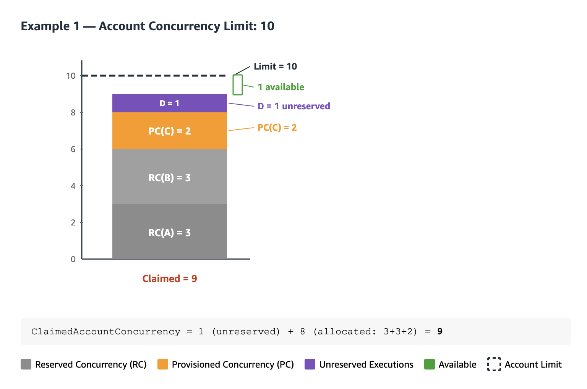
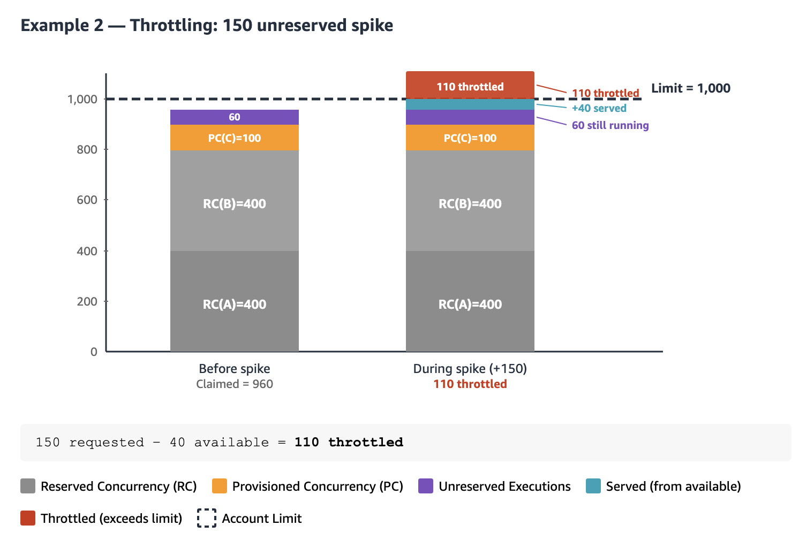
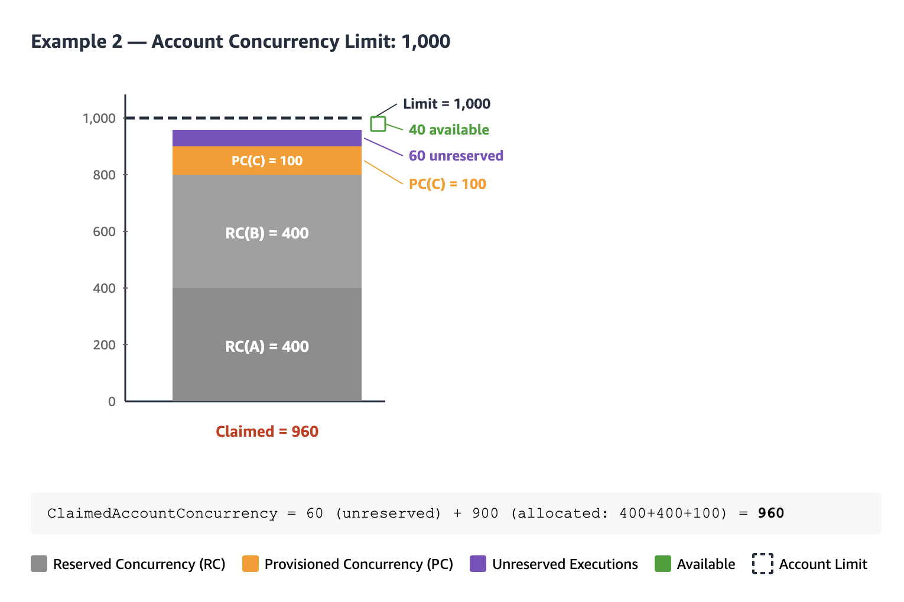

In this article we will explore how to use `ClaimedAccountConcurrency` to monitor concurrency in your region. I will also walk you through understanding this metric, how to set up a CloudWatch alarm step by step, SNS Topic and automate limit increase requests (proportionally to your account limit).


## 1. Understanding the ClaimedAccountConcurrency

For monitoring concurrency Lambda exposes different metrics in CloudWatch:

| Metric | What it measures |
| :------------------------------- | :-------------------------------------------------------------- |
| `ConcurrentExecutions` | The number of active concurrent invocations at a given point in time |
| `UnreservedConcurrentExecutions` | Invocations using the remaining pool (does not consider reserved or provisioned concurrency) |
| `ClaimedAccountConcurrency` | Total concurrency **unavailable** for new on-demand invocations |

**Notes:**
- The `ConcurrentExecutions` metric reflects "The number of active concurrent invocations at a given point in time. Lambda emits this metric for all functions, versions, and aliases." It does not consider concurrency that's been **allocated** through reserved concurrency (RC) or provisioned concurrency (PC). 
- `UnreservedConcurrentExecutions`: is the number of active concurrent invocations that are not using RC and PC.

### So, what does ClaimedAccountConcurrency capture?

```
ClaimedAccountConcurrency = UnreservedConcurrentExecutions + Allocated Concurrency
```

We understand `UnreservedConcurrentExecutions`, but what about **Allocated concurrency**?

Allocated Concurrency represents the sum of both:
1. **Reserved concurrency (RC)**: ensures the function gets a guaranteed slice of the available pool for your region (1000 as a usual default), but it also can't exceed that amount or use unreserved capacity. No other function can use it, even if the function is idle. This can be configured at the function level. Consumes your pool even when not in use.
2. **Provisioned concurrency (PC)**: This allows you to have pre-initialized environments for individual functions. Counts against the pool even when not processing requests. Also consumes the concurrency from the pool even when the configured function is not processing requests.

**Note:** If a function has both RC and PC configured, Lambda counts only the RC (since RC should always be ≥ PC). PC is only counted separately for functions that don't have RC.

If you want to run a quick test in `us-east-1`, set reserved concurrency to a high number (below your limit), invoke any function, then check the metrics below (allow a few seconds to propagate):

```
https://us-east-1.console.aws.amazon.com/cloudwatch/home?region=us-east-1#metricsV2?graph=~(metrics~(~(~(expression~'SERVICE_QUOTA*28m1*29~label~'Current*20Concurrent*20Limit~id~'e1~period~60~yAxis~'left~color~'*239467bd))~(~'AWS*2fLambda~'ConcurrentExecutions~(id~'m1~yAxis~'left~label~'ConcurrentExecutionsMetric~visible~false))~(~'.~'UnreservedConcurrentExecutions~(id~'m3))~(~'.~'ClaimedAccountConcurrency~(id~'m2~yAxis~'left~color~'*23ff7f0e))~(~(expression~'*28m2*2fe1*29*20*2a*20100~label~'*25*20Claimed~id~'e2~period~60~yAxis~'left))~(~(expression~'e1*20-*20m2~label~'Available~id~'e5~period~60~yAxis~'left~color~'*232ca02c))~(~'AWS*2fLambda~'Invocations~(id~'m4~stat~'Sum)))~sparkline~false~view~'timeSeries~stacked~false~region~'us-east-1~period~60~stat~'Maximum~liveData~false~labels~(visible~true)~legend~(position~'bottom)~start~'-PT5M~end~'P0D)&query=~'*7bAWS*2fLambda*7d
```

### 2. Calculating The Regional Limit

"Ahhh, okay, I want to monitor the regional limit, I must track the ConcurrentExecutions metric!"

Well.... nope.

Let's think about this example:

| Configuration | Value |
| :------------------------------- | :-------------------------------------------------------------- |
| Account concurrency limit for your region | 10 |
| Reserved concurrency (function A) | 3 |
| Reserved concurrency (function B) | 3 |
| Provisioned concurrency (function C) | 2 |
| Active executions (unreserved concurrent executions for function D) | 1 |

For this specific example above, `ClaimedAccountConcurrency` is equal to 9, and we only have 1 as our current capacity for this region. 



Another scenario:

| Configuration | Value |
| :------------------------------------------------ | :----- |
| Account concurrency limit | 1,000 |
| Reserved concurrency (function A) | 400 |
| Reserved concurrency (function B) | 400 |
| Provisioned concurrency (function C) | 100 |
| Active executions (unreserved concurrent executions across functions D, E, F) | 60 |

In this example, since all 60 active executions are running within functions that do not have reserved or provisioned concurrency, therefore, the utilization should be 960. See calculation below:

```
ClaimedAccountConcurrency = UnreservedConcurrentExecutions + Allocated Concurrency
ClaimedAccountConcurrency = 60 + allocated concurrency (400 + 400 + 100 = 900)
```

As per the calculation above, only 60 invocations are running, but 900 units are claimed, so actual concurrency available for new on-demand invocations is **40**.



If any executions were running on _unreserved_ functions, `ClaimedAccountConcurrency` and that goes beyond the regional limit will encounter throttling. Possible scenario: If functions D, E, F or any other function in your account (rather than A, B, and C), uses more than 40 concurrent environments.

> In this case if any other functions suddenly spikes , and between them, **150 concurrent executions** happens, only **40** can run immediately and **110** will be throttled (you'll see this in the `Throttles` metric), because only 40 units of unreserved capacity remain (1,000 − 960 = 40)




Once we reviewed the above, this explanation from [official documentation](https://docs.aws.amazon.com/lambda/latest/dg/monitoring-concurrency.html#claimed-account-concurrency) will be more digestible:


Throughout this example above, ClaimedAccountConcurrency is 800 at minimum, despite low actual concurrency utilization across your functions. This is because you allocated 800 total units of concurrency for function-orange and function-blue. From Lambda's perspective, you have "claimed" this concurrency for use, so you effectively have only 200 units of concurrency remaining for other functions.

* At t1, ClaimedAccountConcurrency is 800 (800 + 0 UnreservedConcurrentExecutions)
* At t2, ClaimedAccountConcurrency is 900 (800 + 100 UnreservedConcurrentExecutions)
* At t3, ClaimedAccountConcurrency is again 900 (800 + 100 UnreservedConcurrentExecutions)

---

## 3. What about creating an alarm?

> **Note:** While using Infrastructure as Code (CloudFormation, CDK, Terraform) is more efficient, I am adding instructions via console first for learning purposes. The idea is to review the concepts first, translating to IaC will be straightforward.

### Viewing the relevant metrics

a. Go to **CloudWatch** → **All metrics**

b. Click the **Source** tab

c. Paste the following JSON:

```json
{
  "metrics": [
    [
      "AWS/Lambda",
      "ConcurrentExecutions",
      {
        "id": "m1",
        "yAxis": "left",
        "label": "ConcurrentExecutionsMetric",
        "visible": false
      }
    ],
    [
      {
        "expression": "SERVICE_QUOTA(m1)",
        "label": "Current Concurrent Limit",
        "id": "e1",
        "period": 60,
        "yAxis": "left",
        "color": "#9467bd"
      }
    ],
    [
      "AWS/Lambda",
      "ClaimedAccountConcurrency",
      {
        "id": "m2",
        "yAxis": "left",
        "color": "#ff7f0e"
      }
    ],
    [
      {
        "expression": "(m2/e1) * 100",
        "label": "% Claimed",
        "id": "e2",
        "period": 60,
        "yAxis": "left"
      }
    ],
    [
      {
        "expression": "e1 - m2",
        "label": "Available",
        "id": "e5",
        "period": 60,
        "yAxis": "left",
        "color": "#2ca02c"
      }
    ]
  ],
  "sparkline": false,
  "view": "pie",
  "stacked": false,
  "region": "us-east-1",
  "period": 60,
  "stat": "Maximum",
  "liveData": false,
  "labels": { "visible": true },
  "legend": { "position": "bottom" }
}
```

d. Click **Update**

After pasting the JSON and clicking **Update**, you should see the metrics table populated with all five entries. The table shows each metric's ID, label, details (source metric or expression), statistic, and period:


| ID | Type | Purpose |
| :---- | :---------- | :------------------------------------------------------------------------------------ |
| `m1` | Metric | `ConcurrentExecutions` — used as input for `SERVICE_QUOTA()`. Hidden from the graph. |
| `e1` | Expression | `SERVICE_QUOTA(m1)` — dynamically fetches your actual regional concurrency limit |
| `m2` | Metric | `ClaimedAccountConcurrency` — the metric we want to monitor |
| `e2` | Expression | `(m2/e1) * 100` — utilization as a percentage |
| `e5` | Expression | `e1 - m2` — remaining available concurrency |

> **Why `SERVICE_QUOTA(m1)` instead of hardcoding 1,000?** The concurrency limit is a soft limit. If you've requested an increase, `SERVICE_QUOTA()` dynamically reflects your actual current limit for `ConcurrentExecutions`, so no need to update the alarm every time your quota changes.

If you would like to explore a **Pie** view, select only `ClaimedAccountConcurrency` and `Available` (checkboxes on the left). Ensure to select the specific time period where you intend to reflect on the chart visualization.


Once you have the above, this confirms you have the metrics and expressions that are relevant for monitoring this regional limit.

## 4.  Creating the alarm

a. From CLoudWatch metrics, click the **bell icon** next to the `% Claimed` expression (`e2`)

b. Configure the alarm condition:

| Setting | Value | Why |
| :----------------------- | :------------------- | :---------------------------------------------- |
| **Metric** | `% Claimed` (e2) | The utilization percentage we calculated |
| **Threshold type** | Static | Fixed threshold value |
| **Condition** | Greater than **70** | 70% gives headroom before hitting the limit |
| **Period** | 1 minute | Matches Lambda's metric emission granularity |
| **Statistic** | Maximum | Catches spikes — average would smooth them out |
| **Datapoints to alarm** | 1 out of 1 | Triggers on the first breach |

### Configure actions

Configure an **SNS topic** as the notification target. This can deliver alerts via:

- Email
- Slack (via AWS Chatbot or a Lambda-backed integration)
- Others

### Name the alarm

Give the alarm a descriptive name and optionally add a Markdown description (rendered in the CloudWatch console):


### Review and create

Review the configuration and click **Create alarm**.

### Alarm in action

Once active, the alarm graph shows your utilization over time:

- **Blue line** → `% Claimed` utilization
- **Threshold** → 70%
- The alarm bar at the bottom transitions from **OK** (green) to **In alarm** (red) when the threshold is breached


---

## 4. Extra: automate limit increases

Note:
> Instead of just alerting, you can add a Lambda function as a **direct alarm action** that automatically submits a Service Quotas increase request. The alarm triggers two independent actions:

- **SNS** → notifies your team (email, Slack)
- **Lambda** → requests a concurrency limit increase

> Be careful here, as automating a limit increase can generate extra cost if the scaling is not desired. You can opt to create the notification only.

### The Lambda function

a. Create a new Lambda function with the **Python 3.14** runtime. Once this function is triggered, it will check for any pending quota increase requests, and submits a new one if none exist. The requested value is proportional to the current limit, the request will a proptional value of 10% of the current limit. You can change the percentage via `INCREMENT_PERCENT`.

```python
import boto3
import logging
import math

logger = logging.getLogger()
logger.setLevel(logging.INFO)

SERVICE_CODE = "lambda"
QUOTA_CODE = "L-B99A9384"  # Concurrent executions
INCREMENT_PERCENT = 0.10  # 10% increase

client = boto3.client("service-quotas")

def has_pending_request():
    history = client.list_requested_service_quota_change_history_by_quota(
        ServiceCode=SERVICE_CODE, QuotaCode=QUOTA_CODE
    )
    return any(
        r["Status"] in ("PENDING", "CASE_OPENED")
        for r in history.get("RequestedQuotas", [])
    )

def lambda_handler(event, context):
    alarm_name = event.get("alarmData", {}).get("alarmName", "unknown")
    logger.info(f"Alarm triggered: {alarm_name}")

    if has_pending_request():
        logger.info("Skipping — a quota increase request is already pending")
        return {"status": "SKIPPED", "reason": "pending request exists"}

    current = client.get_service_quota(
        ServiceCode=SERVICE_CODE, QuotaCode=QUOTA_CODE
    )
    current_value = current["Quota"]["Value"]
    
    # Calculate 10% increase and round up to nearest integer
    increment = math.ceil(current_value * INCREMENT_PERCENT)
    desired_value = current_value + increment

    response = client.request_service_quota_increase(
        ServiceCode=SERVICE_CODE,
        QuotaCode=QUOTA_CODE,
        DesiredValue=desired_value,
    )

    status = response["RequestedQuota"]["Status"]
    logger.info(
        f"Requested increase: {current_value} -> {desired_value} "
        f"(+{increment}, {INCREMENT_PERCENT * 100:.0f}%) | Status: {status}"
    )

    return {
        "current": current_value,
        "desired": desired_value,
        "increment": increment,
        "increment_percent": INCREMENT_PERCENT * 100,
        "status": status,
    }
```

### IAM permissions - Execution Role

```json
{
  "Version": "2012-10-17",
  "Statement": [
    {
      "Effect": "Allow",
      "Action": [
        "servicequotas:GetServiceQuota",
        "servicequotas:RequestServiceQuotaIncrease",
        "servicequotas:ListRequestedServiceQuotaChangeHistoryByQuota"
      ],
      "Resource": "*"
    },
    {
      "Effect": "Allow",
      "Action": "iam:CreateServiceLinkedRole",
      "Resource": "arn:aws:iam::*:role/aws-service-role/servicequotas.amazonaws.com/*",
      "Condition": {
        "StringEquals": {
          "iam:AWSServiceName": "servicequotas.amazonaws.com"
        }
      }
    }
  ]
}
```

> **How often will this Lambda get triggered?** CloudWatch Alarm actions trigger on **state transitions**, not continuously. The function is invoked **once** when the alarm transitions from `OK` to `In alarm`. It won't invoke again while the alarm stays in `ALARM` state. If the alarm recovers to `OK` and then breaches again, it invokes once more. The idea is to make function [idempotent](https://www.freecodecamp.org/news/idempotence-explained/).

b. **Add the Lambda alarm action:** Go back to your CloudWatch alarm → **Edit** → **Configure actions** → **Add Lambda action**. Select **In alarm** as the trigger state and choose your function:


The SNS action you configured in Step 5 stays as-is for notifications. The Lambda action runs independently alongside it.

c. Verify the quota request and support case

You can test the function with a small amount. To check it, go to **Service Quotas** → **Recent quota increase requests** and confirm a new request was approved or a new Support Case was created. If new limit was not automatically approved, you should see a new support case being created.


That's it. When concurrency crosses 70%, the alarm fires, your team gets notified via SNS, the Lambda function requests a limit increase, and if not automatically approved, it opens a support case for quota review.

### References:

[AWS Lambda - Understanding function scaling](https://docs.aws.amazon.com/lambda/latest/dg/lambda-concurrency.html) · [Monitoring concurrency](https://docs.aws.amazon.com/lambda/latest/dg/monitoring-concurrency.html)