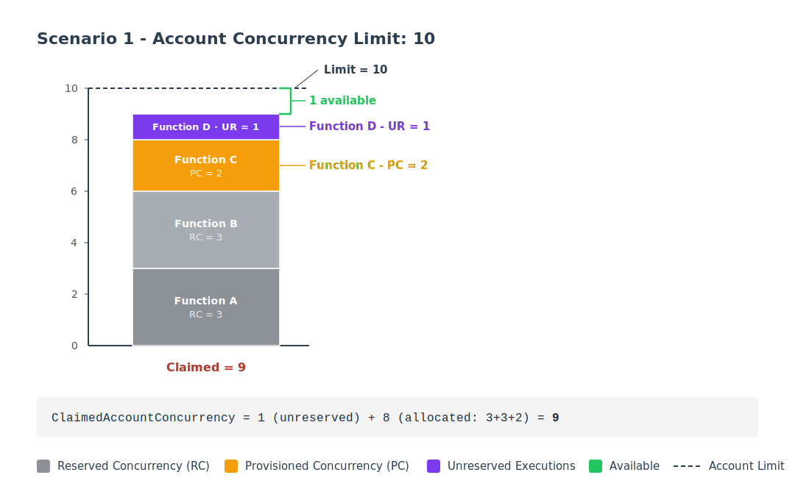
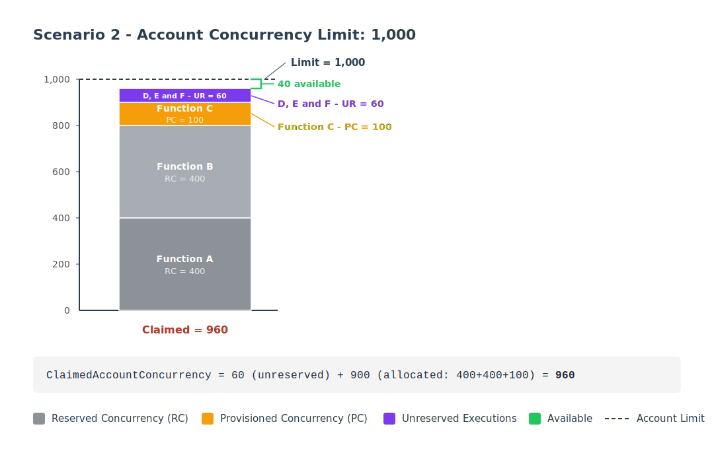
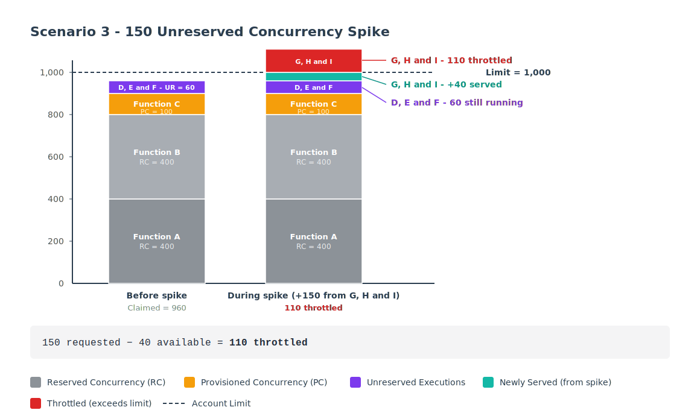
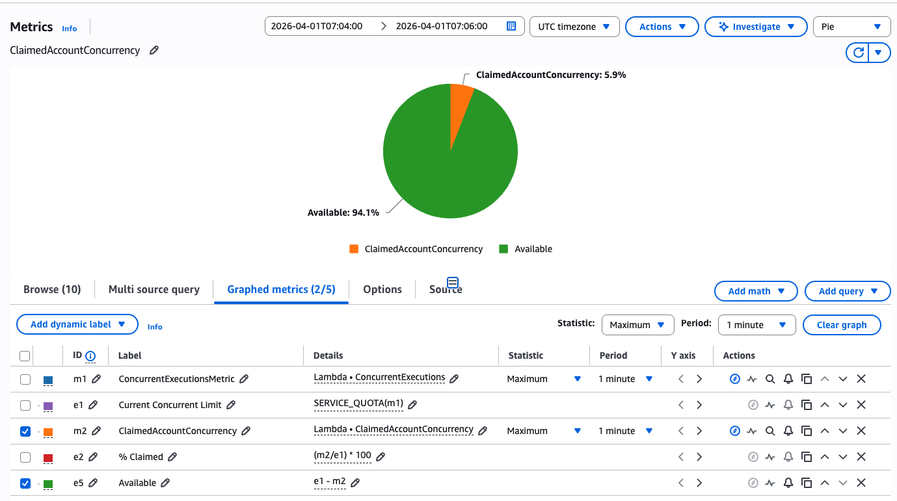
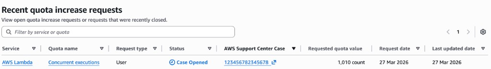
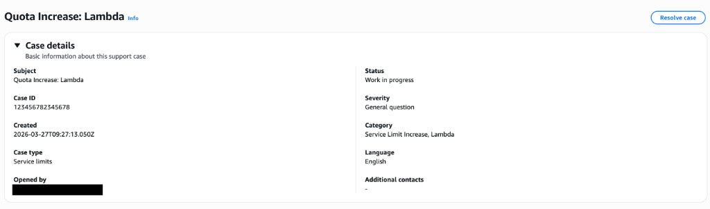

# AWS Lambda: Proactively Monitoring Concurrency with ClaimedAccountConcurrency


## What is AWS Lambda?

AWS Lambda is a compute service that runs your code in response to events (API requests, queue messages, file uploads) without requiring you to manage servers. It scales automatically as traffic increases.

## The problem

When you scale serverless architectures, observability gets noisy fast. Dozens of metrics, dashboards per function, alarms on individual errors. Then one night at 3am you get an alert: regional concurrency limit reached. Requests are being dropped across the entire account. The question you may ask is: can we proactively monitor this?

In this article I will explain what concurrency means, how to monitor it, and how it translates well the current capacity you have for your AWS Region. 

**Topics:**

1. How Lambda concurrency works (just enough to understand the metric choice)
2. Why `ClaimedAccountConcurrency` is the right metric to monitor
3. Setting up a CloudWatch alarm step by step
4. Automating quota increases when the alarm fires

**Considerations:**

This guide includes an automated quota increase considering healthy **organic traffic growth** in your region. 

For critical functions, set a reserved concurrency (e.g. 5) as a permanent guardrail. Reserved concurrency guarantees dedicated capacity that no on-demand functions can consume.

Examples where increasing the limit will not help:

- **Reserved Concurrency over limit increases.** If you have multiple functions in the same region and on-demand traffic is not predictable, use reserved concurrency to protect critical functions rather than raising the overall limit.

Automated increases only make sense for organic growth where the consumer is healthy and the traffic is legitimate. In every other case, throttling can benefit you and act as a circuit breaker.

- **Runaway error loops.** An erroring function. Raising the limit just gives it more room to fail. When the alarm fires, always check whether the consumer is healthy before requesting more capacity. If it is broken, cap it with reserved concurrency instead.

- **Async invocations.** Synchronous invocations get throttled visibly. However, asynchronous invocations (CloudFormation custom resources, S3 triggers, EventBridge) are queued for up to 6 hours. For these, check `AsyncEventAge` and review the `MaximumEventAgeInSeconds` for critical async functions.

**Note:** This guide uses the **AWS Console** intentionally. While Infrastructure as Code (CloudFormation, CDK, Terraform) is more efficient, console-first instructions make the concepts easier to learn. Once you understand the mechanics, translating to IaC is straightforward. A CDK example ready for deployment is available in [`./infrastructure/cdk`](./infrastructure/cdk).

---

## How Lambda concurrency works

In Lambda, concurrency is the number of in-flight requests that your function is currently handling. There are two types of concurrency controls available: Reserved concurrency (RC) and Provisioned concurrency (PC).

Concurrency is the number of in-flight requests that your AWS Lambda function is handling at the same time. For each concurrent request, Lambda provisions a separate instance of your execution environment.

Execution environments are secure, isolated environments that run on hardware-virtualized virtual machines (MicroVMs). They manage the resources required to run your function and contain a runtime, a language-specific environment that relays event information and responses between Lambda and your specific function. In a nutshell, the execution environment manages the resources required to run your function.

For each concurrent request, Lambda provisions a separate instance of your execution environment. As your functions receive more requests, Lambda automatically handles scaling the number of execution environments until you reach your account's concurrency limit. 

By default, Lambda provides your account with a total concurrency limit of 1,000 concurrent executions across all functions in an AWS Region.
To better understand it, let's see this diagram.


From this, at the dashed green line there are **5 active environments**, so the concurrency at that moment is **5**. 

As you can also see, the first request had their "INIT" phase, based on this you can assume they all had a `cold start` and for each, it consumed 1 concurrent execution.

However, requests 6, 7, 8 did not have "INIT". This means they reused environments that started earlier, so, these request were `warm stars`. Then request 9 required a new environment, hence, it was (cold start). After this, request 10 came in (warm start), and then reused a pre-existing enviroment.

For these requests, 6 consumed your concurrency and 4 reused "warm" environments.

### What is my current limit?

By default, every account gets **1,000 concurrent executions per Region**. Hoewver, this is a soft limit you can increase via [Service Quotas](https://docs.aws.amazon.com/servicequotas/latest/userguide/request-quota-increase.html).

> New AWS accounts have reduced concurrency and memory quotas. AWS raises these quotas automatically based on your usage.

For more information, please refer to [Understanding and visualizing concurrency](https://docs.aws.amazon.com/lambda/latest/dg/lambda-concurrency.html#understanding-concurrency).

### Concurrency x RPS

Lambda also enforces a **requests per second** limit equal to 10x your concurrency limit. You can be throttled by this request rate even if concurrency is not full utilized.

> When your regional concurrency limit is hit, throttling can have a cascading affect. If you application relies on lambda as a Middleware between your API, SQS, Kinesis or DynamoDB, thtottles will affect on how these services behave.

---

## 1. Understanding the ClaimedAccountConcurrency

For monitoring concurrency, Lambda exposes different metrics in CloudWatch:

| Metric | What it measures |
| :------------------------------- | :-------------------------------------------------------------- |
| `ConcurrentExecutions` | The number of active concurrent invocations at a given point in time |
| `UnreservedConcurrentExecutions` | Invocations using the remaining pool (does not consider reserved or provisioned concurrency) |
| `ClaimedAccountConcurrency` | Total concurrency **unavailable** for new on-demand invocations |

Notes:
- `ConcurrentExecutions` reflects "The number of active concurrent invocations at a given point in time. Lambda emits this metric for all functions, versions, and aliases." It does not consider concurrency that's been **allocated** through reserved concurrency (RC) or provisioned concurrency (PC). 
- `UnreservedConcurrentExecutions` represents the number of active concurrent invocations that are using unreserved concurrency (Lambda emits this metric across all functions in a region).

"_Ahhh, okay, if I want to monitor the regional limit, I must track the ConcurrentExecutions metric!_"

Well... partially correct. Monitoring these can help with planning distribution of your current limit across your regio and how a specific function is consuming the shared pool; however, for understanding the actual utilization in your region, we must focus on ClaimedAccountConcurrency instead.

### Okay, so, what does ClaimedAccountConcurrency capture?

```
ClaimedAccountConcurrency = UnreservedConcurrentExecutions + Allocated Concurrency
```

We understand `UnreservedConcurrentExecutions`, but what about **Allocated concurrency**?

Allocated Concurrency represents the sum of both:
1. **Reserved concurrency (RC)**: ensures the function gets a guaranteed slice of the available pool for your region. The function also cannot exceed that amount or use unreserved capacity. No other function can use it, even if the function is idle. This can be configured at the function level. It consumes your pool even when not in use.
2. **Provisioned concurrency (PC)**: This allows you to have pre-initialized environments for individual functions. It counts against the pool even when the function is not processing requests.

**Notes:** 

> Lambda always [keeps 100 units ]((https://docs.aws.amazon.com/lambda/latest/dg/lambda-concurrency.html#:~:text=At%20the%20function,the%20function%20level.)) available for functions without RC.

> If a function has both RC and PC configured, Lambda counts only the RC (since RC should always be ≥ PC). PC is only counted separately for functions that don't have RC.


If you want to run a quick test in `us-east-1`, set reserved concurrency to a a function high number (right below your limit), invoke other function, then check the metrics below (allow a few seconds to propagate):

```
https://us-east-1.console.aws.amazon.com/cloudwatch/home?region=us-east-1#metricsV2?graph=~(metrics~(~(~(expression~'SERVICE_QUOTA*28m1*29~label~'Current*20Concurrent*20Limit~id~'e1~period~60~yAxis~'left~color~'*239467bd))~(~'AWS*2fLambda~'ConcurrentExecutions~(id~'m1~yAxis~'left~label~'ConcurrentExecutionsMetric~visible~false))~(~'.~'UnreservedConcurrentExecutions~(id~'m3))~(~'.~'ClaimedAccountConcurrency~(id~'m2~yAxis~'left~color~'*23ff7f0e))~(~(expression~'*28m2*2fe1*29*20*2a*20100~label~'*25*20Claimed~id~'e2~period~60~yAxis~'left))~(~(expression~'e1*20-*20m2~label~'Available~id~'e5~period~60~yAxis~'left~color~'*232ca02c))~(~'AWS*2fLambda~'Invocations~(id~'m4~stat~'Sum)))~sparkline~false~view~'timeSeries~stacked~false~region~'us-east-1~period~60~stat~'Maximum~liveData~false~labels~(visible~true)~legend~(position~'bottom)~start~'-PT5M~end~'P0D)&query=~'*7bAWS*2fLambda*7d
```

## 2. Calculating The Regional Limit

#### Scenario 1 - Account Concurrency Limit: 10

Let's think about this example:

| Configuration | Value |
| :------------------------------- | :-------------------------------------------------------------- |
| Account concurrency limit for your region | 10 |
| Reserved concurrency (function A) | 3 |
| Reserved concurrency (function B) | 3 |
| Provisioned concurrency (function C, PC only — no RC) | 2 |
| Active executions (unreserved concurrent executions for function D) | 1 |

For the example above, `ClaimedAccountConcurrency` is equal to 9, and we only have 1 as our current capacity for this region. 




#### Scenario 2 - Account Concurrency Limit: 1,000

| Configuration | Value |
| :------------------------------------------------ | :----- |
| Account concurrency limit | 1,000 |
| Reserved concurrency (function A) | 400 |
| Reserved concurrency (function B) | 400 |
| Provisioned concurrency (function C, PC only — no RC) | 100 |
| Active executions (unreserved concurrent executions across functions D, E, F) | 60 |

In this example, since 60 active executions are being consumed across functions that do not have reserved or provisioned concurrency, the utilization should be 960. See calculation below:

```
ClaimedAccountConcurrency = UnreservedConcurrentExecutions + Allocated Concurrency
ClaimedAccountConcurrency = 60 + allocated concurrency (400 + 400 + 100 = 900)
```

As per the above, only 60 on-demand invocations are running, but 900 additional units are allocated (claimed by RC/PC), giving a total `ClaimedAccountConcurrency` of **960**. Actual concurrency available for new on-demand invocations is **40**.




#### Scenario 3 - 150 Unreserved Concurrency Spike

If any executions are running on _unreserved_ functions and `ClaimedAccountConcurrency` goes beyond the regional limit, you should expect throttling. 

In this example, you have the Reserved concurrency for functions A, B, and C, and between functions D, E, and F you consume more than 60 concurrent environments (unreserved concurrency). Your total utilization is 960, hence available capacity is 40.

However, in this case you have a new spike and other functions are being invoked concurrently. Let's call them functions G, H, and I. Between them, **150 new concurrent executions** happen (in addition to the 60 we had before). At that point in time, only **40** concurrent executions were available, so only **40** can run immediately. For the remaining **110** concurrent executions you should expect throttling, as the number of concurrent requests will now be above the regional limit. 

Calculation:
-  available concurrency = your regional limit − ClaimedAccountConcurrency
-  1,000 − 960 = 40

Now let's simulate an additional 150 unreserved concurrency:
-  150 (new spike of unreserved concurrency) − 40 (available concurrency)
Result: 110 Throttles.




You can see more examples from [Reserved concurrency diagram](https://docs.aws.amazon.com/lambda/latest/dg/lambda-concurrency.html#understanding-concurrency:~:text=To%20better%20understand%20reserved%20concurrency%2C%20consider%20the%20following%20diagram%3A) and [Provisioned Concurrency + Reserved concurrency diagram](https://docs.aws.amazon.com/lambda/latest/dg/lambda-concurrency.html#:~:text=The%20previous%20example,the%20following%20diagram%3A)

---

## 3. What about creating an alarm?

> **Note:** While using Infrastructure as Code (CloudFormation, CDK, Terraform) is more efficient, I am adding instructions via console first for learning purposes. The idea is to review the concepts first; translating to IaC will be straightforward.

### Viewing the relevant metrics

a. Go to **CloudWatch** → **All metrics**

b. Click the **Source** tab

c. Paste the following JSON:

```json
{
  "metrics": [
    [
      "AWS/Lambda",
      "ConcurrentExecutions",
      {
        "id": "m1",
        "yAxis": "left",
        "label": "ConcurrentExecutionsMetric",
        "visible": false
      }
    ],
    [
      {
        "expression": "SERVICE_QUOTA(m1)",
        "label": "Current Concurrent Limit",
        "id": "e1",
        "period": 60,
        "yAxis": "left",
        "color": "#9467bd"
      }
    ],
    [
      "AWS/Lambda",
      "ClaimedAccountConcurrency",
      {
        "id": "m2",
        "yAxis": "left",
        "color": "#ff7f0e"
      }
    ],
    [
      {
        "expression": "(m2/e1) * 100",
        "label": "% Claimed",
        "id": "e2",
        "period": 60,
        "yAxis": "left"
      }
    ],
    [
      {
        "expression": "e1 - m2",
        "label": "Available",
        "id": "e5",
        "period": 60,
        "yAxis": "left",
        "color": "#2ca02c"
      }
    ]
  ],
  "sparkline": false,
  "view": "pie",
  "stacked": false,
  "region": "us-east-1",
  "period": 60,
  "stat": "Maximum",
  "liveData": false,
  "labels": { "visible": true },
  "legend": { "position": "bottom" }
}
```

d. Click **Update**

After pasting the JSON and clicking **Update**, you should see the metrics table populated with all five entries. The table shows each metric's ID, label, details (source metric or expression), statistic, and period:


| ID | Type | Purpose |
| :---- | :---------- | :------------------------------------------------------------------------------------ |
| `m1` | Metric | `ConcurrentExecutions` - used as input for `SERVICE_QUOTA()`. Hidden from the graph. |
| `e1` | Expression | `SERVICE_QUOTA(m1)` - dynamically fetches your actual regional concurrency limit |
| `m2` | Metric | `ClaimedAccountConcurrency` - the metric we want to monitor |
| `e2` | Expression | `(m2/e1) * 100` - utilization as a percentage |
| `e5` | Expression | `e1 - m2` - remaining available concurrency |

> **Why `SERVICE_QUOTA(m1)` instead of hardcoding 1,000?** The concurrency limit is a soft limit. If you've requested an increase, `SERVICE_QUOTA()` dynamically reflects your actual current limit for `ConcurrentExecutions`, so no need to update the alarm every time your quota changes.

If you would like to explore a **Pie** view, select only `ClaimedAccountConcurrency` and `Available` (checkboxes on the left). Ensure to select the specific time period where you intend to reflect on the chart visualization.




Once you have the above, this confirms you have the metrics and expressions that are relevant for monitoring this regional limit.

## 4. Creating the alarm

a. From CloudWatch metrics, click the **bell icon** next to the `% Claimed` expression (`e2`)

b. Configure the alarm condition:

| Setting | Value | Why |
| :----------------------- | :------------------- | :---------------------------------------------- |
| **Metric** | `% Claimed` (e2) | The utilization percentage we calculated |
| **Threshold type** | Static | Fixed threshold value |
| **Condition** | Greater than **70** | 70% gives headroom before hitting the limit |
| **Period** | 1 minute | Matches Lambda's metric emission granularity |
| **Statistic** | Maximum | Catches spikes - average would smooth them out |
| **Datapoints to alarm** | 1 out of 1 | Triggers on the first breach |

### Configure actions

Configure an **SNS topic** as the notification target. This can deliver alerts via:

- Email
- Slack (via AWS Chatbot or a Lambda-backed integration)
- Others

### Name the alarm

Give the alarm a descriptive name and optionally add a Markdown description (rendered in the CloudWatch console):


### Review and create

Review the configuration and click **Create alarm**.

### Alarm in action

Once active, the alarm graph shows your utilization over time:

- **Blue line** → `% Claimed` utilization
- **Threshold** → 70%
- The alarm bar at the bottom transitions from **OK** (green) to **In alarm** (red) when the threshold is breached


---

## 5. Extra: automate limit increases

Instead of just alerting, you can add a Lambda function as a **direct alarm action** that automatically submits a Service Quotas increase request. The alarm triggers two independent actions:

- **SNS** → notifies your team (email, Slack)
- **Lambda** → requests a concurrency limit increase

### The trade-off, and how this solution handles it

Fully automating limit increases can generate extra cost, since it would keep driving your limit higher on every alarm transition.

To ensure a mitigation for a temporary pain, without creating additional headaches (if a limit increase is not desired), this solution aims to create a function that runs one time only. Here is the idea:

1. The Lambda requests **one** bounded limit increase (current limit +10%).
2. Immediately after, the function **sets its own reserved concurrency to 0**. From Lambda's perspective this function is now un-invokable, so any future alarm action call is throttled for this specific function. Therefore, no new limit increases will be submitted.
3. SNS still keeps notifying the team on every alarm transition, so humans are always in the loop. However, the proportional first limit increase was applied or is in progress (if not automatically approved via Service Quotas).
4. A human review remains mandatory.

> If you prefer zero automation, just skip the Lambda action and keep only SNS. The rest of this section assumes you want the bounded safety net.

### The Lambda function

a. Create a new Lambda function with the **Python 3.14** runtime. Once this function is triggered, it will check for any pending quota increase requests and submit a new one if none exist. The requested value is proportional to the current limit; the request will be for a proportional value of 10% of the current limit. You can change the percentage via `INCREMENT_PERCENT`.

After a successful request, the function **disables itself by setting its own reserved concurrency to 0**. This turns the function into a one-shot safety net: the next alarm firing will not trigger another auto-increase until a human re-enables it. This is a deliberate pattern to avoid runaway auto-increases compounding cost or masking over-allocated reserved/provisioned concurrency.

> **How often will this Lambda get triggered?** CloudWatch Alarm actions trigger on **state transitions**, not continuously. The function is invoked **once** when the alarm transitions from `OK` to `In alarm`. It won't invoke again while the alarm stays in `ALARM` state. If the alarm recovers to `OK` and then breaches again, it invokes once more. Hence the solution with RC=0.

```python
import os
import boto3
import logging
import math

logger = logging.getLogger()
logger.setLevel(logging.INFO)

SERVICE_CODE = "lambda"
QUOTA_CODE = "L-B99A9384"  # Concurrent executions
INCREMENT_PERCENT = float(os.environ.get("INCREMENT_PERCENT", "0.10"))
MAX_LIMIT = float(os.environ.get("MAX_LIMIT", "5000"))

quotas = boto3.client("service-quotas")
lambda_client = boto3.client("lambda")


def has_pending_request():
    paginator = quotas.get_paginator(
        "list_requested_service_quota_change_history_by_quota"
    )
    for page in paginator.paginate(ServiceCode=SERVICE_CODE, QuotaCode=QUOTA_CODE):
        for r in page.get("RequestedQuotas", []):
            if r["Status"] in ("PENDING", "CASE_OPENED"):
                return True
    return False


def disarm_self(function_name):
    """Set this function's reserved concurrency to 0 so future alarm invocations are throttled by Lambda itself."""
    lambda_client.put_function_concurrency(
        FunctionName=function_name,
        ReservedConcurrentExecutions=0,
    )
    logger.warning(
        f"Auto-increase DISABLED: set {function_name} RC=0. "
        f"A human must re-enable the function to allow future auto-increases."
    )


def lambda_handler(event, context):
    alarm_name = event.get("alarmData", {}).get("alarmName", "unknown")
    logger.info(f"Alarm triggered: {alarm_name}")

    if has_pending_request():
        logger.info("Skipping: a quota increase request is already pending")
        disarm_self(context.function_name)
        return {"status": "SKIPPED", "reason": "pending request exists"}

    current = quotas.get_service_quota(
        ServiceCode=SERVICE_CODE, QuotaCode=QUOTA_CODE
    )
    current_value = current["Quota"]["Value"]

    # Calculate proportional increase, rounded up, and cap at MAX_LIMIT
    increment = math.ceil(current_value * INCREMENT_PERCENT)
    desired_value = min(current_value + increment, MAX_LIMIT)

    if desired_value <= current_value:
        logger.warning(f"At MAX_LIMIT={MAX_LIMIT}. Not requesting.")
        disarm_self(context.function_name)
        return {"status": "SKIPPED", "reason": "at max limit", "current": current_value}

    response = quotas.request_service_quota_increase(
        ServiceCode=SERVICE_CODE,
        QuotaCode=QUOTA_CODE,
        DesiredValue=desired_value,
    )

    status = response["RequestedQuota"]["Status"]
    logger.info(
        f"Requested increase: {current_value} -> {desired_value} "
        f"(+{increment}, {INCREMENT_PERCENT * 100:.0f}%) | Status: {status}"
    )

    # Disabling here so the next increase requires a human decision
    disarm_self(context.function_name)

    return {
        "current": current_value,
        "desired": desired_value,
        "increment": increment,
        "increment_percent": INCREMENT_PERCENT * 100,
        "status": status,
    }
```

### IAM permissions - Execution Role

```json
{
  "Version": "2012-10-17",
  "Statement": [
    {
      "Effect": "Allow",
      "Action": [
        "servicequotas:GetServiceQuota",
        "servicequotas:RequestServiceQuotaIncrease",
        "servicequotas:ListRequestedServiceQuotaChangeHistoryByQuota"
      ],
      "Resource": "*"
    },
    {
      "Sid": "SelfDisarmViaReservedConcurrency",
      "Effect": "Allow",
      "Action": "lambda:PutFunctionConcurrency",
      "Resource": "arn:aws:lambda:*:*:function:limit-increase-request-python-314"
    },
    {
      "Effect": "Allow",
      "Action": "iam:CreateServiceLinkedRole",
      "Resource": "arn:aws:iam::*:role/aws-service-role/servicequotas.amazonaws.com/*",
      "Condition": {
        "StringEquals": {
          "iam:AWSServiceName": "servicequotas.amazonaws.com"
        }
      }
    }
  ]
}
```

> The `lambda:PutFunctionConcurrency` resource ARN is scoped to this function only. Even if you use this IAM role somewhere else, it not allow this IAM action for any other function.

b. **Add the Lambda alarm action:** Go back to your CloudWatch alarm → **Edit** → **Configure actions** → **Add Lambda action**. Select **In alarm** as the trigger state and choose your function:


The SNS action you configured in Step 4 stays as-is for notifications. The Lambda action runs independently alongside it.

c. Verify the quota request and support case

You can test the function by invoking it directly from the AWS Console. After you invoke it, go to **Service Quotas** → **Recent quota increase requests** and confirm if the limit increase request was sent/approved or a new Support Case was created.





That's it. When concurrency crosses 70%, the alarm fires, your team gets notified via SNS, the Lambda function requests a limit increase. If limit increase is not automatically approved, `Service Quotas` opens a support case in your account that will be assigned for human review.

### Re-enabling the function

Once the team gets the alarm and start investigating, they can re-enable the limit increase function by removing the RC settings. Therefore, the automation will be ungated.

As a reminder, `ReservedConcurrentExecutions: 0` means that any request will be throttled.

## CDK Solution

If you'd rather skip the console steps and deploy everything as code, see this [example](https://github.com/jonathanbcsouza/my_articles/tree/main/lambda-concurrency-monitoring/iac) in CDK using Typescript.
Both produce the same stack (alarm, SNS topic, Lambda, IAM). Pick whichever language you prefer. See the README in each folder for deploy steps.

### References:

- [Monitoring concurrency](https://docs.aws.amazon.com/lambda/latest/dg/monitoring-concurrency.html)
- [Understanding and visualizing concurrency](https://docs.aws.amazon.com/lambda/latest/dg/lambda-concurrency.html#understanding-concurrency)