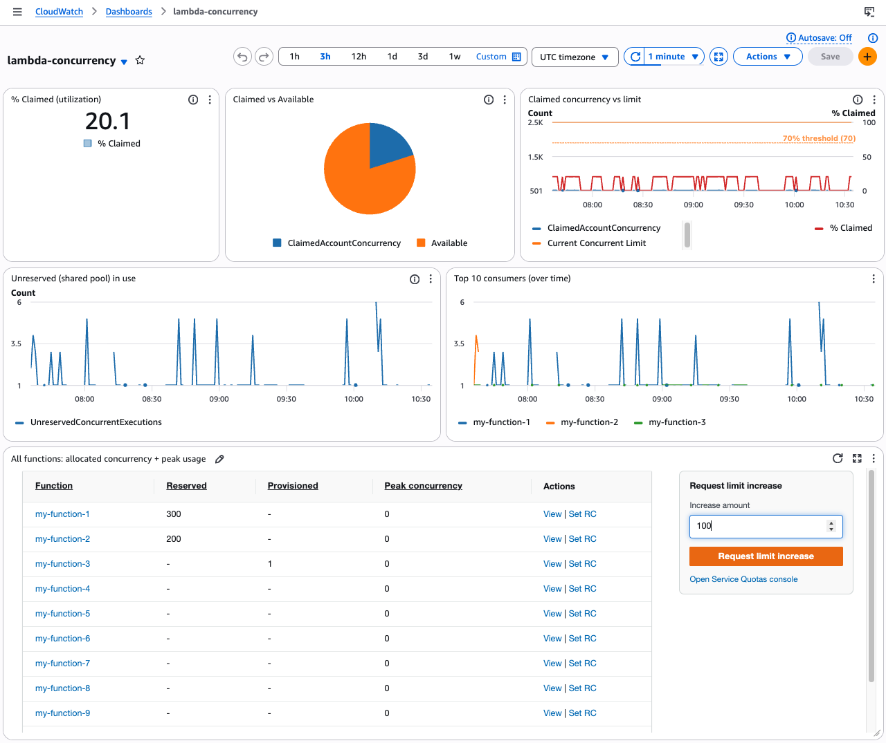

# Lambda Concurrency Dashboard

CDK app that deploys a CloudWatch dashboard for Lambda concurrency in your account/Region. Standalone — does not deploy the alarm stack in [`../iac`](../iac).



## Deploy

```bash
cd dashboard-project
npm install
npx cdk bootstrap   # once per account/Region
npx cdk deploy
```

Uses `CDK_DEFAULT_ACCOUNT` and `CDK_DEFAULT_REGION` from your environment.

Open the dashboard: **CloudWatch → Dashboards → `lambda-concurrency`**

## Resources this CDK deploys

| Resource | Name |
|---|---|
| CloudFormation stack | `LambdaConcurrencyDashboardStack` |
| CloudWatch dashboard | `lambda-concurrency` |
| Lambda function | `concurrency-dashboard-widget` |
| CloudWatch log group | `/aws/lambda/concurrency-dashboard-widget` (7-day retention) |
| IAM role + policies | Lambda execution role; read Lambda/CloudWatch; Service Quotas on quota button |
| Lambda permission | Allows CloudWatch to invoke the custom widget |

Does **not** deploy: CloudWatch alarms, SNS, or `limit-increase-request` (those are in [`../iac`](../iac)).

## Customize

| What | Where |
|---|---|
| Dashboard name, 70% threshold | [`lib/concurrency-dashboard-stack.ts`](lib/concurrency-dashboard-stack.ts) |
| Default quota increment (+10) | `DEFAULT_INCREMENT` in [`lambda/handler.py`](lambda/handler.py) |

## Destroy

```bash
npx cdk destroy
```
